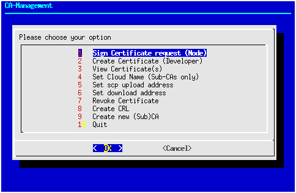
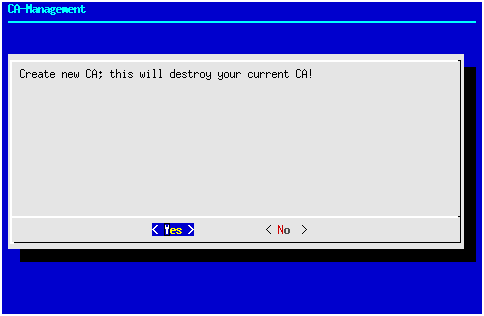
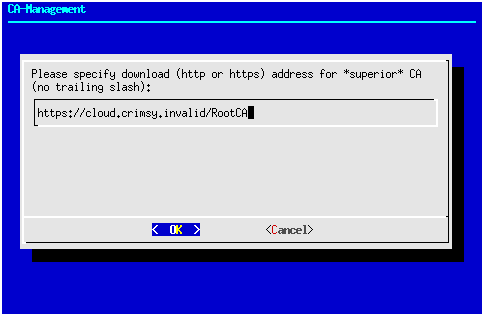
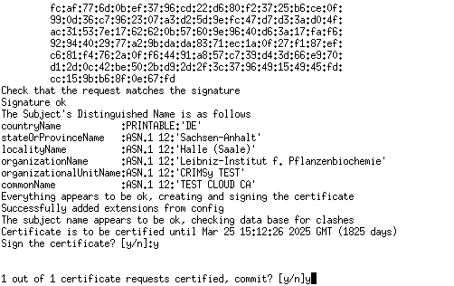
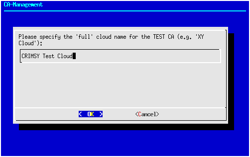
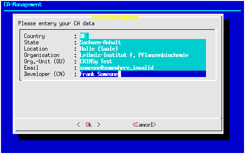
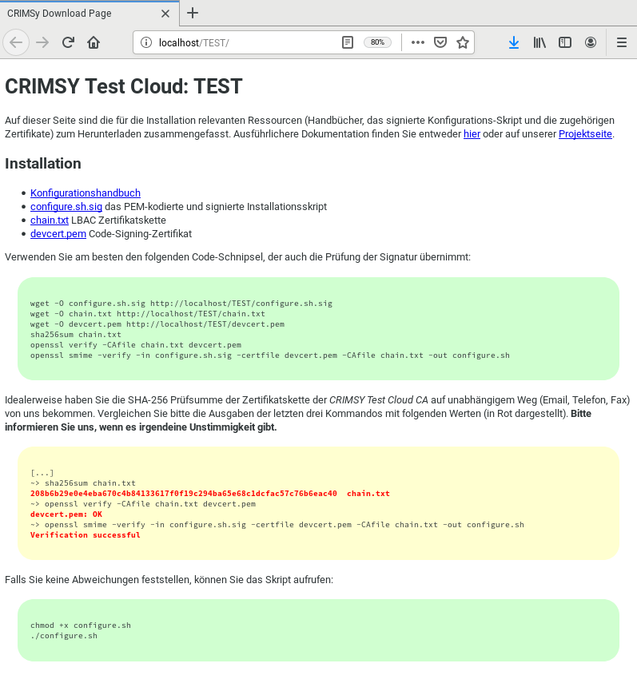

Phase 1
=======
Die Einrichtung einer Cloud beginnt mit dem Clonen des Repositories bzw. Auschecken oder Herunterladen der Quellen. Seit März 2020 sind die Quellen über GitHub verfügbar: 
::

        git clone https://github.com/ipb-halle/CRIMSy.git

Durch das Clonen wird ein Verzeichnis CRIMSy mit den Quellen angelegt. Alle weiteren Aktionen finden - soweit nichts anderes angegeben ist - in diesem Verzeichnis statt.

Als nächstes muss die Distribution konfiguriert werden. Dies beinhaltet das Anlegen einer Stammzertifizierungsstelle (Root CA) und einer Zertifizierungsstelle für die geplante Cloud (eine Sub-CA). Die Einrichtung erfolgt jeweils mit dem Script `util/bin/camgr.sh`. Alle Konfigurationsdaten der Cloud einschließlich der CAs werden im Source-Tree unterhalb des Verzeichnis config/ gespeichert. Durch eine entsprechende Einstellung in .gitignore ist sichergestellt, dass die Konfiguration nicht in das Sourcecode-Repository eingecheckt wird. Viele Funktionen des `camgr.sh`-Scripts sind menügesteuert und verwenden (weitestgehend) eine Curses-Oberfläche. Einige Parameter (z.B. die Cloud) müssen jedoch über Kommandozeilenoptionen übergeben werden. Andere Funktionen (Ausstellen eines Zertifikats, Erzeugung der Zertifikatssperrliste / Certificate Revocation List - CRL) sind auch über die Kommandozeile zugänglich, da das Skript `camgr.sh` auch in automatisiert ablaufenden Prozessen benutzt wird. Mit der Kommandozeilenoption "--help" kann man sich einen Hilfetext anzeigen lassen. Das Hauptmenü des Scripts sieht wie folgt aus:

.. note:: Das camgr.sh-Script beendet sich momentan nach jedem Schritt und muss demzufolge für einen darauffolgenden Schritt neu gestartet werden.

In einem ersten Schritt muss eine neue CA (= Zertifizierungsstelle) mit einem neuen CA-Zertifikat (Zertifizierungsstellenzertifikat) angelegt werden. Das aktuelle Betriebskonzept sieht eine dreistufige Zertifikatshierarchie vor: An oberster Stelle steht eine Stammzertifizierungsstelle (Root-CA), die Zertifikate für weitere Zertifizierungsstellen (Sub-CAs bzw. Zwischen-CAs) ausstellt. Es ist nicht vorgesehen, dass die Root-CA Zertifikate für Knoten ausstellt. Die Sub-CAs (eine Sub-CA für jede Cloud) stellen die Zertifikate für Knoten ihrer jeweiligen Cloud aus. Auf der untersten Ebene erhält jeder Knoten ein Zertifikat der Zertifizierungsstelle (Sub-CA) seiner Cloud. 

.. note:: Ursprünglich (d.h. in der *Leibniz Bioactives Cloud*) wurden die Zertifikate für die Knoten direkt von der Root-CA ausgestellt. Da CRIMSy einen dezentralen Ansatz verfolgt, können die Sub-CAs von unterschiedlichen Root-CA beglaubigt werden.

Sofern noch keine Root-CA existiert, die die Sub-CA für eine Cloud beglaubigt, sollte zunächst eine neue Root-CA angelegt werden. Rufen Sie dazu `camgr.sh` ohne Kommandozeilenargumente auf und wählen Sie Menüpunkt 9. Es ist möglich, ohne eigene Root-CA zu arbeiten, und die Sub-CA der Cloud von einer fremden Root-CA zertifizieren zu lassen. Das Script `camgr.sh` unterstützt jedoch hauptsächlich ein spezifisches Szenario, so dass abweichende Szenarien manuelle Eingriffe nötig machen können. **Achtung: Beim Anlegen einer neuen CA wird eine eventuell bestehende CA zerstört!**

=============================== ==============================
.. image:: img/camgr_03.png     .. image:: img/camgr_04.png
------------------------------- ------------------------------
CA-Warnung                      CA-Daten
=============================== ==============================

Wie in der Abbildung zu sehen, werden im nächsten Schritt die Daten für die Root-CA abgefragt. Daran schließt sich eine Überprüfung der Daten an.

=============================== ==============================
.. image:: img/camgr_05.png     .. image:: img/camgr_06.png
------------------------------- ------------------------------
CA: URL                         CA: SCP
=============================== ==============================

Für die Root-CA müssen außerdem eine Download-URL und eine *Secure Copy*-Adresse angegeben werden (beide ohne *trailing slash*). Über die Download-URL sind das Zertifikat der CA, die Sperrliste (CRL) sowie weitere öffentliche Informationen abrufbar. Aus der URL wird die URL der Zertifikatssperrliste durch Anhängen von `crl.pem` gebildet und in das Zertifikat übertragen. Die URL im Zertifikat kann später nicht mehr geändert werden! Die *Secure Copy*-Adresse dient dazu, das Zertifikat, die Sperrliste und weitere Informationen (einen Java-Truststore und eine Adressliste) hochzuladen.  Idealerweise sollte `scp` mit Public Key Authentifizierung konfiguriert sein, damit die Kopiervorgänge ohne Passworteingabe funktionieren.

Für die Einrichtung eine Sub-CA für die Cloud `TEST` muss das Skript mit der Option `--cloud TEST` aufgerufen werden:
::

        ./util/bin/camgr.sh --cloud TEST

Die nächsten Schritte (Warnhinweis, Erfassung und Prüfung der Daten, Download-URL und *Secure Copy*-Adresse) laufen dann zunächst analog zur Einrichtung der Root-CA ab: 

=============================== ==============================
.. image:: img/camgr_07.png     .. image:: img/camgr_08.png
------------------------------- ------------------------------
Sub-CA: Daten                   "Sub-CA: Prüfung
=============================== ==============================

=============================== ==============================
.. image:: img/camgr_09.png     .. image:: img/camgr_10.png
------------------------------- ------------------------------
Sub-CA: URL                     "Sub-CA: SCP
=============================== ==============================

Die Unterschiede beginnen, wenn die Download-URL der übergeordneten CA (***superior***, also der Root-CA) abgefragt wird. Falls Sie die übergeordnete CA selbst betreiben, geben Sie bitte die gleiche URL wie bei der Erstellung der Root-CA an: 

Sub-CA: URL der Root-CA

Falls Sie die Root-CA nicht selbst betreiben, müssen Sie sicherstellen, dass alle benötigten Informationen unter der Download-URL verfügbar sind:

* die Zertifikatskette der übergeordneten CA in der Datei `chain.txt`; auf diese Weise sind auch mehrstufige CA-Hierarchien möglich
* die Zertifikatssperrliste in der Datei `crl.pem`
* ein Java-Keystore mit allen Zertifikaten der Zertifikatskette in der Datei `truststore` sowie das zugehörige Keystore-Passwort in der Datei `truststore.passwd`
* eine Datei `addresses.txt` mit dem (Kurz-)Namen der CAs, *subject hashes*, Fingerprints, sowie den URLs von CA-Zertifikat und CRL aller Zertifikate der Zertifikatskette; 5 Spalten jeweils durch Tabulator getrennt.

Obwohl im Dialog nur die Protokolle `http:` bzw. `https:` angegeben sind, können Sie hier ausnahmsweise auch `file:` benutzen.  Das Skript `camgr.sh` wird dann die Dateien der übergeordneten CA in das Verzeichnis der Sub-CA kopieren und einen Zertifikatsrequest für die Sub-CA erstellen. Im nächsten Schritt muss anhand dieses Zertifikatsrequests ein Zertifikat für die Sub-CA ausgestellt werden. Falls Sie die übergeordnete CA nicht selbst betreiben, müssen Sie den Zertifikatsrequest (die Datei `config/.../CA/cacert.req`) an die übergeordnete CA übermitteln. Ansonsten reicht der Aufruf der beiden Kommandos (hier gezeigt am Beispiel einer Cloud `TEST`):
::

    ./util/bin/camgr.sh --mode sign \
      --extension v3_subCA \
      --input ./config/TEST/CA/cacert.req \
      --output ./config/TEST/CA/cacert.pem

    ./util/bin/camgr.sh --mode importSubCA \
      --cloud TEST

Das erste Kommando veranlasst die Ausstellung des Zertifikats mit der Erweiterung `v3_subCA` durch die Root-CA, so das mit diesem Zertifikat andere Zertifikate beglaubigt werden können. Die Pfade können entweder absolut oder relativ zum aktuellen Verzeichnis angegeben werden.

Root-CA: Zertifikatsbestätigung

Das zweite Kommando "importiert" anschließend das Zertifikat und stellt schon praktisch die Betriebsbereitschaft der Sub-CA her. Zu guter Letzt sollte aber noch der Langname der Cloud gesetzt werden:

Sub-CA: langer Cloud Name

Dabei ist zu beachten, dass das Skript `camgr.sh` immer mit der Option `--cloud` und dem Kurznamen der Cloud (z.B. `TEST`)aufgerufen werden muss: 
::

    ./util/bin/camgr.sh --cloud TEST

da ansonsten die Einstellungen der Root-CA verändert werden.

Für die Funktion der Cloud sind aktuelle Zertifikatssperrlisten notwendig. Am besten werden diese regelmäßig (z.B. 1x täglich) durch einen CRON-Job aktualisiert. Es ist wichtig, sämtliche Zertifikatssperrlisten der Zertifikatskette aktuell zu halten. Ein CRON-Eintrag könnte wie folgt aussehen:
::

    #
    # CRL erzeugen
    #
    #Min Hour Day Month Week Cmd
    # Root-CA
    20 10 * * * /home/someone/git/CRIMSy/util/bin/camgr.sh --mode genCRL 2>/dev/null >/dev/null
    #
    # Sub-CA
    21 10 * * * /home/someone/git/CRIMSy/util/bin/camgr.sh --mode genCRL --cloud TEST 2>/dev/null >/dev/null

Der CRON-Job sollte zum selben Nutzer gehören, der auch die Quellen ausgecheckt hat.

Für die Absicherung der Softwarepakete durch digitale Signaturen wird ein Entwicklerzertifikat benötigt. Dies kann ebenfalls mit dem Skipt `camgr.sh` ausgestellt werden. Es ist darauf zu achten, dass das Entwicklerzertifikat von der CA der jeweiligen Cloud ausgestellt wurde. Entwickler-Zertifikate der Root-CA sind momentan ohne Nutzen. Nachfolgend ist die Ausstellung eines Entwicklerzertifikats für die Cloud `TEST` illustriert (d.h. Aufruf des Skripts mit `./util/bin/camgr.sh --cloud TEST`). Im Skript ist dazu Menüpunkt 2 "Create Certificate (Developer)" aufzurufen:

Sub-CA: Entwickler-Zertifikat

=============================== ==============================
.. image:: img/camgr_15.png     .. image:: img/camgr_16.png
------------------------------- ------------------------------
Entwicklerzert. Prüfung         Entwicklerzert. Bestätigung
=============================== ==============================

Wie üblich schließen sich daran die Überprüfung der Eingaben und die Bestätigung der Zertifikatsausstellung an.

Die erste Setup-Phase schließt mit dem Hochladen des Konfigurationsscripts ab. Dies erfolgt ganz einfach durch Aufruf des Skripts `upload.sh` mit dem Kurznamen der Cloud als Argument:
::

    ./util/bin/upload.sh TEST

Anschließend muss unter der Download-Adresse der Distribution in etwa folgende Seite aufrufbar sein:

Distibutions-Webseite

In der zweiten Phase müssen die einzelnen Knoten der Cloud und vor allem der Master-Knoten konfiguriert werden. Ausgangspunkt ist die eben erwähnte Distributions-Seite. Die genaue Vorgehensweise ist im Manual Konfiguration und Installation und speziell im Abschnitt Konfigurationsskript beschrieben.

