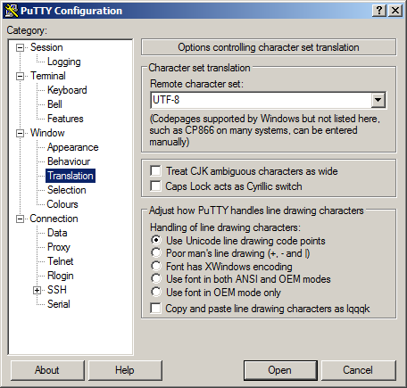

# Konfiguration und Installation
Die nachfolgenden Abschnitte befassen sich mit der Konfiguration, der Installation und dem Management eines Knotens aus Sicht eines lokalen Administrators. Das Handbuch behandelt folgende Teilaspekte:

1. Vorbetrachtungen / Installationsvoraussetzungen
2. Konfigurationsskript
3. Konfiguration eines externen Proxy (optional)
4. Installation
5. Management des Knotens

Vor der Installation bzw. während des Installationsvorgangs müssen einige Parameter (z.B. Speicherorte, Hostnamen, private Schlüssel oder Zertifikatspasswörter) konfiguriert werden. Einige dieser Einstellungen sind sensitiv. Der gesamte Konfigurations- und Installationsprozess ist so gestaltet, dass sensitive Informationen Ihre Einrichtung nie verlassen.

> **Wichtig:** _Wir haben bei der Entwicklung von CRIMSy Wert auf Sicherheit und Datenschutz gelegt. Die Software darf jedoch keinesfalls zur Speicherung und Verarbeitung sensitiver personenbezogener Daten (z.B. Patientendaten) verwendet werden! Näheres entnehmen Sie bitte dem Handbuch Systembeschreibung (Kapitel Risikoanalyse)._

## Ablauf
Zunächst prüfen Sie die im folgenden Abschnitt beschriebenen Systemanforderungen und stellen ein entsprechend konfiguriertes System zusammen. Anschließend laden Sie das Konfigurationsskript und unsere Schlüssel herunter. Nachdem Sie die digitale Signatur des Konfigurationssskripts verifiziert haben, führen Sie dieses aus und senden uns die vom Skript erstellte Konfigurationsdatei zu. Anhand dieser Konfigurationsdatei wird von uns ein Installationspaket betriebsfertig konfektioniert, an Sie verteilt und schließlich von Ihnen in Betrieb genommen.

> **Hinweis:** _Für die Konfiguration und die Installation benutzen Sie bitte einen einzigen dedizierten unprivilegierten Account._

Falls Sie die Konfiguration über PuTTY ausführen wollen, stellen Sie bitte den Zeichensatz auf UTF-8 um.

## Systemanforderungen
In der Einstiegsphase sind zum Betrieb eines Cloud-Knotens 1 - 2 CPU-Kerne, 2 GByte RAM und ca. 20 GByte Plattenspeicher sowie eine Netzwerkanbindung ab ca. 10 Mbit/s ausreichend. Die Entwicklung erfolgt auf virtualisierter x86\_64-Hardware (KVM). Der Cloud-Knoten kann also als virtuelle Maschine betrieben werden – ein dedizierter physischer Server ist nicht notwendig. Sofern eine Java Runtime zur Verfügung steht, sollte der Betrieb auch auf jeder anderen Architektur (z.B. ARM) möglich sein. Eine Gewähr wird hierfür jedoch nicht übernommen.

## Speicher
Ein Teil des Plattenspeichers wird für die permanente Speicherung der lokalen Cloud-Daten verwendet. In der Standardeinstellung wird hierfür das Verzeichnis Home-Verzeichnis des Nutzers verwendet, der das Konfigurationsskript aufruft. Diese Einstellung ist jedoch konfigurierbar. Diese Daten sollten durch ein regelmäßiges Backup vor Datenverlust geschützt werden. Wichtig: für das Datenverzeichnis soll kein Netzwerkdateisystem (z.B. NFS) verwendet werden.

> **Info:** _Es gibt Szenarien, in denen der Einsatz von NFS unvermeidbar ist, z.B. wenn ein ESX-Cluster seine Volumes per NFS von einem NetApp Filer bezieht. Innerhalb des Knotens bzw. aus Knotensicht handelt es sich hier jedoch nicht um den Einsatz von NFS, da dies dem Knoten vollständig verborgen ist._

## Betriebssystem
Die Entwicklung erfolgt unter OpenSUSE (aktuell OpenSUSE 15.1 LEAP). Ein Knoten der Cloud setzt sich dabei aus mehreren Docker Containern zusammen. Die Verwendung anderer Linux-Distributionen ist möglich, getestet wurde unter anderem Ubuntu. Ein direkter Betrieb unter Windows wird nicht empfohlen, da während Installation und Betrieb zahlreiche Linux/Unix-Werkzeuge zum Einsatz kommen, die bei einem Betrieb unter Windows zahlreiche Anpassungen erforderlich machen würden.

## Software
Zusätzlich zu einem minimalen Linux-System erfordern Installation und Betrieb eines Cloud-Knotens folgende Software:

*   Docker und Docker Compose (ab Docker Version 1.12)
*   Dialog (NCurses-Dialoge für Shell-Skripte)
*   GnuZip
*   m4 Makroprozessor
*   ed (Unix Line Editor)
*   OpenSSL
*   ssh (nur falls Remote-Administration gewünscht wird)
*   sudo
*   tar
*   sharutils (uuencode / uudecode)
*   uuidgen
*   wget (evtl. zukünftig curl)

## Benutzer
Für die Cloud sollte auf dem Knoten ein unprivilegierter Benutzer (z.B. lbac) eingerichtet werden. Dieser Benutzer benötigt Zugriff auf die verwendeten Schlüssel und Zertifikate (s.u.). Für bestimmte Zwecke (z.B. Einrichten von Cron-Jobs, Starten von Docker-Containern) benötigt dieser Nutzer auch Zugriff auf eine administrative Shell (sudo). Während der Installation konfiguriert sich das Setup-Skript einen entsprechenden Zugang für den unprivilegierten Benutzer, wofür einmalig das Root-Passwort benötigt wird.

> **Info:** _Zur Erhöhung der Sicherheit kann die sudo-Berechtigung nach Beendigung des Installationsskripts wieder entzogen werden. Dazu muss die Datei `/etc/sudoers.d/lbac` gelöscht werden._

Falls der Speicherort nicht anderweitig konfiguriert wurde, sollte das Homeverzeichnis des Nutzers ausreichend freien Platz für die Daten des Knotens haben (aktuell 10 GByte).

## Zertifikate
Für die Absicherung der Maschine-zu-Maschine-Kommunikation der Knoten untereinander und für die Softwareverteilung werden Zertifikate eingesetzt. Für jede Cloud gibt es eine eigene Zertifizierungsstelle (CA - Certificate Authority), die diese Zertifikate ausstellt. Die Authentizität einer Zertifizierungsstelle kann anhand der sha256-Hashwerte der Zertifikatskette überprüft werden. Wichtig: Die Authentizität der Cloud-Installation hängt von einer sorgfältigen Prüfung dieser Hash-Werte ab. Folgende Zertifizierungsstellen sind momentan bekannt: 

------------------------------------- ---------------------------------
 Hash-Wert der Zertifikatskette        Cloud
------------------------------------- ---------------------------------
`acb7b11ec12d21a83da6a47cc8b0ee89..`  Leibniz Bioactives Cloud
`..0a73e33f3a9dc23b7cafcc21f2343098`  (nur Zertifikat: `cacert.pem`)

`725ed0ea27e7f91bc9248ae19deb6aac..`  Leibniz Bioactives Cloud
`..47f3a5597ee2d2dd96e9f8f131c0365f`  (Zertifikatskette: `chain.txt`)

------------------------------------- ---------------------------------

> **Info:** _Die Leibniz Bioactives Cloud stellt insofern eine Besonderheit dar, als dass zunächst nur das Zertifikat verbreitet wurde. Ab Version CRIMSy 1.3.x gibt es auch für die Leibniz Bioactives Cloud eine 'Zertifikatskette', die allerdings auch nur das selbe CA-Zertifikat enthält._

Die Zertifikatsketten sowie zugehörige Zertifikatssperrlisten usw. können von den jeweiligen Distributionsseiten heruntergeladen werden. Die URL und etwaige Credentials können beim Verwalter der Cloud erfragt werden. Die vom Verwalter übermittelten Informatioenn sollten auch den Hashwert der Zertifikatskette beinhalten, um durch Übermittlung auf einem unabhängigen Kanal die Sicherheit zu erhöhen.

> **Info:** _Die Webadressen, Prüfsummen usw. dieses Handbuchs beziehen sich auf die von den CRIMSy-Entwicklern verwalteten Clouds (z.B. die Leibniz Bioactives Cloud). Falls Sie eine separate Distribution betreiben (vielleicht für Maschinenbauer oder Germanisten), werden die Webadressen, Prüfsummen usw. abweichen. Der Verantwortliche einer separaten Distribution sollte aber die unabhängige Prüfung der Authentizität der Zertifikate, Konfigurations- und Installationsskripte ermöglichen (z.B. über eine zusätzliche Email-Information)._

Das Zertifikat für Ihren Knoten wird bei der Zusammenstellung des Installationspakets durch uns erzeugt und basiert auf dem während der Konfiguration erstellten Zertifikatsrequest. Für die Interaktion mit dem Nutzer sollte ein offizielles (d.h. ein von einer allgemein akzeptierten CA herausgegebenes) Zertifikat verwendet werden, um Fehlermeldungen im Browser des Nutzers zu vermeiden. Als Fallback-Lösung kann jedoch auch das Zertifikat Ihrer Cloud-CA benutzt werden.

Die privaten Schlüssel Ihrer Zertifikate (sowie die zugehörigen Passwörter) verlassen Ihren Knoten niemals.

