Konfigurationsskript
====================

Das digital signierte Konfigurationsskript steht auf der Distributions-Webseite der Cloud zum Herunterladen zur Verfügung. Die URL und die Credentials für den Zugriff werden vom Verwalter per Email mitgeteilt. Die Beispielwerte in den hier dargestellten Code-Schnipseln sind entsprechend zu ersetzen; zur Vereinfachung enthält die Distributionswebseite entsprechende Vorlagen für Copy & Paste.  

.. code-block:: none

    wget -O conimage.sh.sig \
      https://test.crimsy.invalid/TEST/configure.sh.sig
    wget -O chain.txt \
      https://test.crimsy.invalid/TEST/chain.txt
    wget -O devcert.pem \
      https://test.crimsy.invalid/TEST/devcert.pem
    sha256sum chain.txt
    openssl verify -CAfile chain.txt devcert.pem
    openssl smime -verify -in configure.sh.sig -certfile \
        devcert.pem  -CAfile chain.txt -out configure.sh

Zur Prüfung der Authentizität vergleichen Sie bitte die Ausgabe in Ihrem Terminal mit den kursiv markierten Zeilen in folgendem Block, wobei der Hash-Code cloudspezifisch ist:

.. code-block:: none
    :emphasize-lines: 4, 6, 9

    [...]
    
    ~> sha256sum chain.txt 
    725 ...      Hash Code der Cloud-CA-Zertifikatskette     ... 65f chain.txt
    ~> openssl verify -CAfile chain.txt devcert.pem 
    devcert.pem: OK
    ~> openssl smime -verify -in configure.sh.sig -certfile \
        devcert.pem -CAfile chain.txt -out configure.sh
    Verification successful

**Bitte benachrichtigen Sie uns (bzw. Ihren Cloud-Verwalter) unbedingt, falls bei der Prüfung Ungereimtheiten auftreten.** Falls die Signaturprüfung des Konfigurationsskripts erfolgreich war, können Sie das Skript anschließend aufrufen:

.. code-block:: none

    chmod +x configure.sh
    ./configure.sh

Das Konfigurationsskript beginnt mit einer Informationsseite:

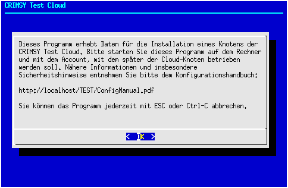

.. note:: Da unsere Ressourcen sehr begrenzt sind, kann das Konfigurationsskript nur eine rudimentäre Prüfung der Eingabeparameter vornehmen. Durch entsprechend bösartige Eingaben (Backquotes "\`", $-Zeichen usw.) können wahrscheinlich Datenverluste und möglicherweise auch anderweitige Schäden provoziert werden. Bitte kontaktieren Sie uns, wenn Sie eines der Zeichen \`"'\$ verwenden müssen.

Als nächstes wird der Speicherort für die Daten der Cloud festgelegt:

Im einfachsten Fall können sie die Default-Einstellung übernehmen. Die größtmögliche Ausbaufähigkeit sichern Sie sich, wenn sie das Dateisystem als "logical volume" (LVM, ZFS, ...) anlegen. Im weiteren Verlauf wird dieser Speicherort in der Variable `$LBAC_DATASTORE` gespeichert. Auch in der Dokumentation wird diese Variable entsprechend verwendet.  Falls das Konfigurationsskript im angegebenen Speicherort eine Konfigurationsdatei aus früheren Läufen des Skripts finden kann, werden Sie gefragt, ob Sie diese einlesen wollen:

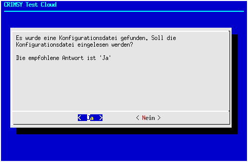

In den allermeisten Fällen sollten Sie die Datei einlesen lassen, Sie sparen dadurch Tipparbeit. Eine kritische Prüfung aller Eingaben bleibt dennoch unerläßlich. Das Skript zeigt als nächstes den Unique Identifier des Knotens an:

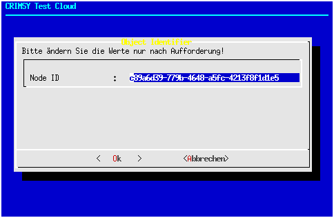

An diesem Wert sollten Sie nur Änderungen vornehmen, wenn Sie von uns dazu aufgefordert werden. Die nächste Frage ist eine einfache Kontrollfrage, ob Ihr System über ausreichende Ressourcen verfügt:

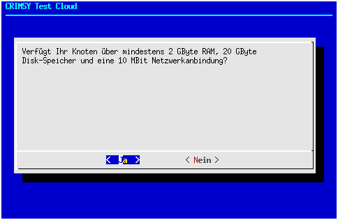

Wir hoffen, Sie können diese Frage mit "Ja" beantworten. 

Im darauffolgenden Formular können Sie entscheiden, ob Ihr Knoten durch HTTP Strict Transport Security (HSTS) abgesichert werden soll. Für Installationen im produktiven Einsatz wird dies klar empfohlen. Die Einstellung setzt jedoch ein Zertifikat einer offiziellen Zertifizierungsstelle voraus. Für Test-Setups, bei denen Zertifikate einer CRIMSy-CA genutzt werden, sollte HSTS entsprechend nicht aktiviert werden.

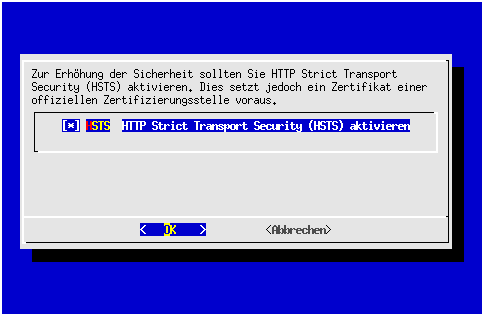

Mittlerweile verwenden viele Linux-Distributionen SystemD als Init-System. Im Rahmen des Konfigurationsskripts wird abgefragt, für welches System der Knoten konfiguriert werden soll, damit CRIMSy nach einem Neustart des Knotens automatisch starten kann. SystemV-Init-Skripte existieren für alle anderen Distributionen und als Fallback-Lösung; es finden allerdings keine Tests statt.  

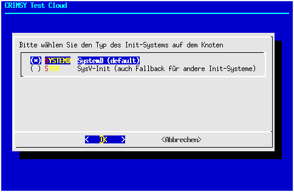

Ebenso ist für die Verwaltung des Knotens wichtig, ob auf dem Knoten noch andere Docker-Container ausgeführt werden. Die parallele Ausführung weiterer Container bedeutet, das beim Aufräumen von Docker-Containern, -Images und Volumes weniger aggressiv vorgegangen werden muss. Deshalb wird von der parallelen Ausführung weiterer Container auf dem Knoten dringend abgeraten.

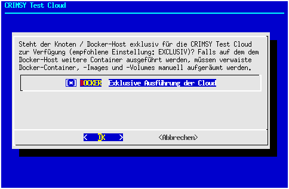

Als nächstes wird der Name Ihrer Einrichtung (Ihres Instituts) abgefragt. Geben Sie bitte die vollständige offizielle deutsche Bezeichnung an (ohne Adresse). Der hier abgefragte Name wird den Nutzern der Cloud angezeigt. Der Wert dieses Feldes wird außerdem in das Formular für den Zertifikatsantrag übertragen, kann dort aber angepasst werden, wenn für den Zertifikatsantrag eine andere Schreibung (z.B. wegen Umlauten) gewünscht wird.

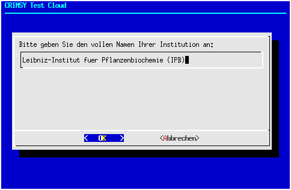

Da der vollständige Name des Instituts manchmal unhandlich lang sein kann, wird im folgenden Formular eine Kurzbezeichnung abgefragt. Die Kurzbezeichnung sollte sich üblicherweise aus einer Abkürzung des Institutsnamens und dem Ort des Hauptsitzes zusammensetzen:

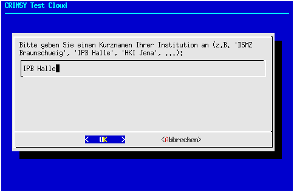

Eine weitere wichtige Information ist die Emailadresse einer Kontaktperson, die für die Administration des Knotens zuständig ist. Selbstverständlich ist auch eine Sammeladresse (z.B. helpdesk@somewhere.invalid) möglich.

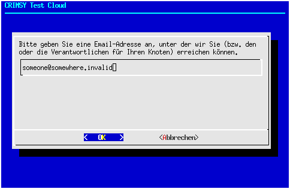

Zur Erhöhung der Sicherheit wird CRIMSy nicht mit einem fest vorgegebenen Standardpasswort für den Administrator-Account installiert. Stattdessen wird im Rahmen der Konfiguration ein Passwort abgefragt, mit dem der Administrator-Account initialisiert wird. Das Passwort wird im Klartext auf der lokalen Platte des Knotens gespeichert. Daher sollte das Admin-Passwort nach der Installation umgehend geändert werden.

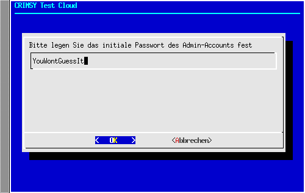

Sowohl für die Erstellung des Zertifikats (Subject Alternate Names) als auch für die Konfiguration des Proxy werden die Hostnamen Ihres Knotens benötigt. Dabei kann sich der Hostname im Intranet vom Hostnamen im Internet unterscheiden, weshalb beide abgefragt werden. Die Portnummer für die Kommunikation aus dem Internet ist auf 8443 festgelegt und kann nicht geändert werden.

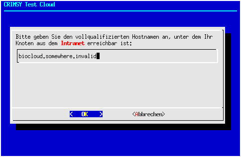

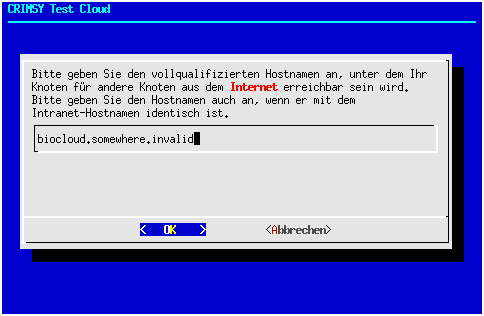

In den folgenden Schritten muss für den Knoten ein Zertifkatsrequest erstellt werden. Falls jedoch bereits ein Zertifikatsrequest ausgestellt wurde, kann dieser geprüft und gegebenenfalls wiederverwendet werden (hier nicht gezeigt).

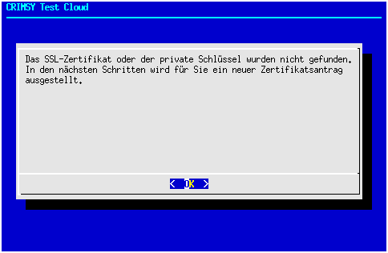

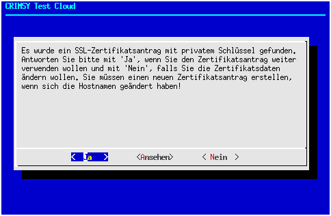

Das Konfigurationsskript übernimmt dabei die Felder "Organisation" und "Email" aus den bislang erfassten Daten; es sind aber Änderungen möglich. Zusätzlich müssen der Staat (Vorauswahl "DE"), das Bundesland, der Ort und die Organisationseinheit (Vorauswahl ist "Verwaltung")  eingegeben werden.

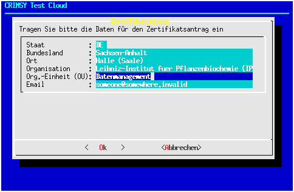

Nach Erfassung der Daten wird mit OpenSSL ein Zertifikatsrequest erzeugt. Auf Ihrem Terminal werden vorübergehend einige Ausgaben des Programms sichtbar sein. Im nächsten Formular sind Sie aufgefordert, die Daten des Zertifikatsrequests zu prüfen. Mit den Pfeiltasten bzw. PageUp und PageDown können Sie den Text scrollen.

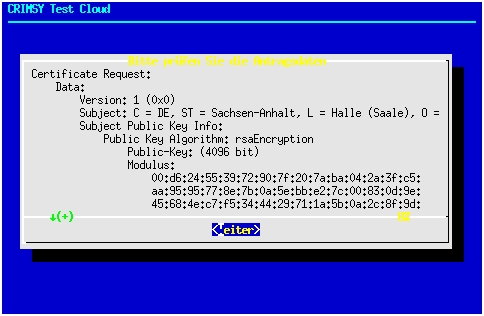

Falls alle Daten (auch die Hostnamen) richtig sind, können Sie dies im nächsten Formular bestätigen:

Falls Sie korrigieren möchten, kehrt das Skript zur Erfassung der (vollqualifizierten) Hostnamen zurück. Ansonsten erscheint eine Informationsseite zum Zertifikatsantrag und zur Verwendung eines "offiziellen" Zertifikats für die Nutzerkommunikation:

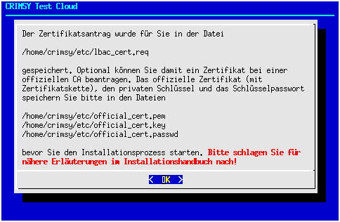

Die Konfiguration ist damit abgeschlossen und das Ergebnis sollte noch abgespeichert werden:

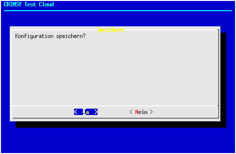

Die abgespeicherte Konfiguration wird anschließend verschlüsselt:

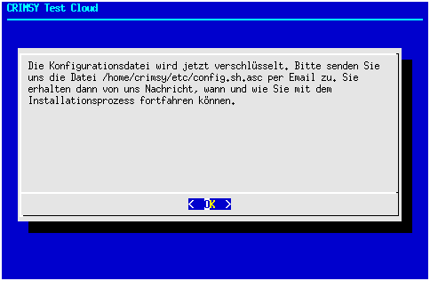

... und das Konfigurationsskript verabschiedet sich mit der Bitte, uns die verschlüsselte Konfiguration zukommen zu lassen (z.B. per Email).

Direkt nach Abschluß des Konfigurationsskripts sollte auch das offizielle Zertifikat für den Knoten beantragt werden, das für die Kommunikation mit den Browsern der Nutzer verwendet wird. Normalerweise sollte es ausreichend sein, den unter `$LBAC_DATASTORE/etc/lbac_cert.req` gespeicherten Zertifikatsrequest des Konfigurationsskripts bei einer CA (z.B. der DFN-PKI) einzureichen. Falls die CA nicht bereit ist, ein Zertifikat für diesen Request auszustellen, müssen Sie selbst einen passenden Request erzeugen.

Das weitere Vorgehen zur Installation des offiziellen Zertifikats richtet sich danach, ob Sie (1) das Zertifikat mit dem Zertifikatsrequest des Konfigurationsskripts beantragt haben oder (2) einen unabhängigen Request erzeugt haben. Im zweiten Fall wurde nämlich ein neuer privater Schlüssel erzeugt, während im ersten Fall die privaten Schlüssel identisch sind. Entsprechendes gilt auch für die Passworte der privaten Schlüssel.

.. note:: Das offizielle Zertifikat (und ggf. der private Schlüssel und das Passwort) müssen momentan nach der Konfiguration manuell in das Konfigurationsverzeichnis `$LBAC_DATASTORE/etc/` kopiert werden. Die Dateinamen sind festgelegt und lauten:
 
.. tabularcolumns:: |l|p{8cm}|

+------------------------+----------------------------------------------------------------+
| **Datei**              | **Beschreibung**                                               |
+------------------------+----------------------------------------------------------------+
| `official_cert.pem`    | Das offizielle Zertifikat im PEM-Format                        |
+------------------------+----------------------------------------------------------------+
| `official_cert.key`    | Der private Schlüssel des offiziellen Zertifikats. Falls das   |
|                        | offizielle Zertifikat mit dem vom Konfigurationsskript         |
|                        | erzeugten Zertifikatsrequest beantragt wurde, muss der         |
|                        | private Schlüssel `lbac_cert.key` kopiert werden. Ansonsten    | 
|                        | verwenden Sie bitte den privaten Schlüssel Ihres unabhängigen  |
|                        | Zertifikatsrequests.                                           |
+------------------------+----------------------------------------------------------------+
| `official_cert.passwd` | Das Passwort für den privaten Schlüssel des offiziellen        |
|                        | Zertifikats. Falls der private Schlüssel `lbac_cert.key`       |
|                        | dupliziert wurde (s.o.), muss auch die Passwortdatei           |
|                        | `lbac_cert.passwd` kopiert werden. Ansonsten hinterlegen Sie   |
|                        | bitte das Passwort für den privaten Schlüssel in dieser Datei. |
+------------------------+----------------------------------------------------------------+

