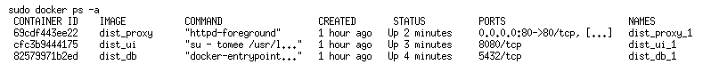

# Installation
An die Konfiguration schließt sich die Installation an. Die Datei `$LBAC_DATASTORE/bin/install.sh` ist ein kurzes Shellskript, welches bereits bei der Konfiguration angelegt wurde. Dieses Skript lädt das eigentliche Installationspaket herunter, entschlüsselt es und überprüft die digitale Signatur, bevor die Installation ausgeführt wird. Das Installationspaket ist ein Shell-Skript mit eingebettetem, base64-codiertem tar.gz-Archiv, das alle notwendigen Bestandteile für die Installation enthält. Das Installationspaket wird für jede Einrichtung separat erzeugt und enthält neben der eigentlichen Software (WAR-Datei, Java-Bibliotheken, Docker-Konfiguration) auch Informationen über den Master-Knoten und das Zertifikat für die Cloud-interne Kommunikation. Der Dateiname des Installationspakets ergibt sich aus dem MD5-Hash des Namens der Einrichtung, z.B. `Leibniz-Institut fuer Pflanzenbiochemie (IPB)` → `10e8bcf6014cdd7ccc82b54ddaffdb00.asc.sig`.

Das Installationsskript kann mit verschiedenen Kommandozeilenoptionen aufgerufen werden, die an das Installationspaket durchgereicht werden. Momentan kann der Installationsprozess mit folgenden Optionen modifiziert werden:

------------------- -------------------------------------------------------------
Option              Erläuterung
------------------- -------------------------------------------------------------
`--help`            Zeigt einen Hilfetext an und beendet das Programm ohne weitere Aktionen

`--debug`           Öffnet die Ports der Datenbank (5432) und TomEE (8080) für direkte Zugriffe auf die Docker-Container. 

`--noproxy`         Überschreibt die Einstellungen des Konfigurationsskripts und installiert einen Knoten ohne Proxy. In diesem Fall muss ein externer Proxy eingerichtet werden.

`--proxy`           Überschreibt die Einstellungen des Konfigurationsskripts und installiert einen Knoten mit Proxy-Container.

`--skip-preinstall` Überspringt die Prä-Installationsroutinen, in denen z.B. Backups der bisherigen Installation angelegt werden.

`--standalone`      Führt eine Erstinstallation so aus, dass keine Referenz auf den Master-Knoten eingetragen wird, so dass der Knoten selbst als Master operiert. Diese Option ist hauptsächlich "zum Ausprobieren" gedacht. Ein Standalone-Knoten kann nachträglich nicht in einen normalen Knoten umgewandelt werden - hierzu ist eine Neuinstallation notwendig. Insbesondere müssen die Verzeichnisse `data/` und `dist/` gelöscht werden.  Bei späteren Installationen (Updates, ...) hat diese Option keine Wirkung.
------------------- -------------------------------------------------------------

Der größte Teil des Installationsskripts wird mit einem unprivilegierten Account ausgeführt. Für eine Reihe von Installationsschritten sind jedoch administrative Privilegien notwendig. Hierunter fallen

* die Installation der Init-Skripte
* die Änderung der Ordner-Eigentümer im Verzeichnis data/
* die Erstellung von Backups
* die Erstellung von Cron-Jobs
* die Erzeugung von Docker-Images und -Containern

Hierfür wird auf das Kommando `sudo` zurückgegriffen, dessen Benutzung einmalig autorisiert werden muss. Mit Ausnahme der Passworteingabe sind für die Installation keine weiteren Nutzer-Interaktionen notwendig.

Sofern das Installationsskript beim Aufruf kein offizielles Zertifikat findet, wird das Zertifikat der Leibniz Bioactives Cloud CA als Fallback-Lösung verwendet. In diesem Fall kann einfach das Installationsskript ein zweites Mal aufgerufen werden, nachdem das Zertifikat nachträglich in das Konfigurationsverzeichnis kopiert wurde.

In der Regel ist der Knoten nach Durchlaufen aller Installationsschritte betriebsbereit. Eine Überprüfung kann mit dem Befehl `sudo docker ps -a` erfolgen und sollte in etwa folgendes Ergebnis liefern :

Sofern alle Container ordnungsgemäß gestartet wurden, kann der Knoten mit einem Webbrowser benutzt und weiter konfiguriert werden (s.u.). 

> **Wichtig:** _Insbesondere sollte als erstes das beim Konfigurationsprozess vergebene initiale Passwort des lokalen Administrator-Accounts (admin) geändert werden!_

Durch die bei der Installation hinterlegte Adresse des Master-Knotens werden die übrigen Knoten der Cloud dem neuen Knoten in den ersten Minuten seines Betriebs bekannt. Hierzu ist ungehinderte HTTPS-Kommunikation mit externen Knoten auf Port 8443 notwendig.

Leider kommt es gelegentlich vor, dass ein oder mehrere Container nicht ordentlich starten. In einigen Fällen hilft es, die beteiligten Container und Images vom Init-Script neu erstellen zu lassen:

    sudo bash
    systemctl stop lbac.service
    # pause for some time
    systemctl start lbac.service

Bei unseren Tests kam es aber auch vor, dass wir beschädigte Container, Images und Volumes mit den Kommandozeilenwerkzeugen `docker-compose` bzw. `docker` beseitigen bzw. reparieren mussten. In Einzelfällen wurde der Docker-Daemon in Mitleidenschaft gezogen, so dass wir unseren Docker-Host durchbooten mussten.

> **Info:** Eine vollständige Dokumentation aller Eventualitäten oder gar deren automatische Behebung liegen leider jenseits unserer Möglichkeiten. Bitte kontaktieren Sie uns im Falle eines Falles.

