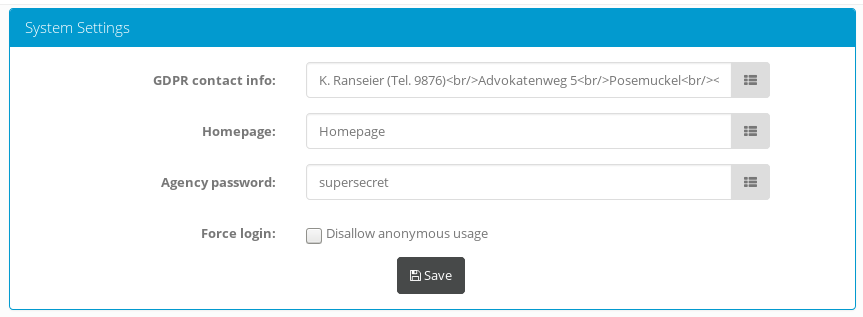
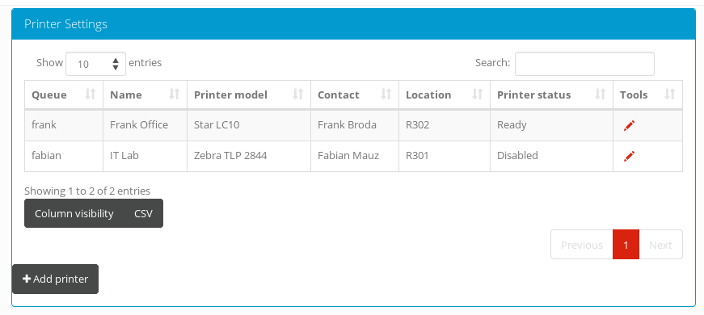
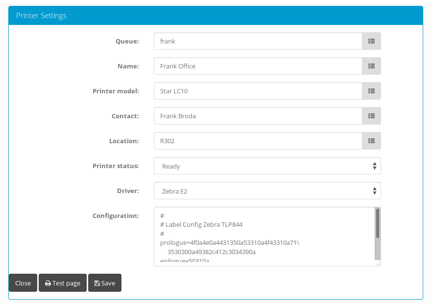

Management des Knotens
======================
.. warning:: Das Standardpasswort des Administrators (`admin` → `admin`) sollte umgehend nach der Installation geändert werden!

Einige Einstellungen des Knotens können zur Laufzeit mit dem Webbrowser konfiguriert werden. Dazu gehören

* Nutzer- und Gruppenverwaltung
    - Passwortänderungen für lokale Accounts (z.B. lokaler Administrator)
    - Hinzufügen bzw. Deaktivierung von lokalen Nutzern und Gruppen
    - Ändern von Gruppenmitgliedschaften
    - Anbindung an LDAP-Verzeichnisse (z.B. Active Directory)
* Ändern von Systemeinstellungen
* Konfiguration eines externen Job-Schedulers
* Verwaltung von Barcode-Druckern
* Verwaltung von Collections (Anlegen, Ändern, Löschen, ...)

Systemeinstellungen
-------------------

In den Systemeinstellungen können momentan 4 Einstellungen verwaltet werden:

* Die Kontaktinformationen des Datenschutzbeauftragten (HTML-formatiert), wie sie in der Datenschutzerklärung des Knotens angezeigt werden sollen
* Die Homepage der den Knoten betreibenden Institution
* Das *shared secret* für die Jobverwaltung (**Achtung:** wird im Klartext angezeigt)
* Ein Flag, ob die anonyme Nutzung des Knotens möglich ist oder ob die Anmeldung obligatorisch ist

Die Änderung von Systemeinstellungen ist den Mitgliedern der lokalen Administratoren-Gruppe vorbehalten. Da einige Eingaben in den Systemeinstellungen im Kontext des Nutzerbrowsers interpretiert werden, müssen die Mitgliedschaften in der Administratorengruppe restriktiv gehandhabt werden.

Barcode-Drucker
---------------
Für klassisches Reporting setzt CRIMSy auf die Erzeugung von PDF-Dateien, die im Nutzerbrowser angezeigt werden können und die der Nutzer herunterladen oder über die ihm zugänglichen Drucker ausdrucken kann. Barcode-Drucker sind jedoch eine spezielle Klasse von Geräten, die sich unter anderem dadurch auszeichnen, dass sie auf ungewöhnliche Papierformate drucken und zum Teil recht komplex konfiguriert werden müssen. Beispielsweise müssen unterschiedliche Label-Formate, Druckgeschwindigkeiten, das Etikettenmaterial und der Schneidemechanismus für Etiketten konfiguriert werden. Die Installation und Konfiguration spezieller Treiber auf jedem einzelnen Nutzer-PC ist daher mit hohem Aufwand verbunden. Außerdem würde diese Herangehensweise die Nutzer mit unnötiger Komplexität konfrontieren.
Bei der Entwicklung von CRIMSy wurde daher ein anderer Ansatz gewählt: Barcode-Drucker werden von CRIMSy über eigene Treiber direkt angesteuert. Der Systemadministrator konfiguriert die Drucker einmalig zentral. Nutzer können den für sie passenden Drucker aus einem Drop-Down-Menü auswählen. 

Da CRIMSy üblicherweise in einer DMZ betrieben wird, können die Drucker nicht direkt angesteuert werden. Alle Druckjobs landen daher in einer Warteschlange, die von einem externen Dienst (CRIMSy Agency) abgearbeitet wird. CRIMSy Agency fragt den Knoten dabei regelmäßig ab, ob neue Druckaufträge vorliegen und leitet diese dann an einen Druckspooler (z.B. CUPS) weiter. Die Zuordnung erfolgt dabei über den Queue-Namen.

Die Druckertreiber sind recht flexibel gehalten und können konfiguriert werden. Dadurch ist es möglich, das Layout lokaen Wünschen anzupassen. Die Konfiguration erfolgt durch `Schlüssel=Wert`-Paare, wobei die Werte Hexadezimal eingegeben werden. Zeilen die mit einem Doppelkreuz als erstem Zeichen beginnen, werden ignoriert; ein Backslash als letztes Zeichen auf einer Zeile signalisiert, dass weitere Hexwerte auf der nächsten Zeile folgen (siehe Abbildung).
