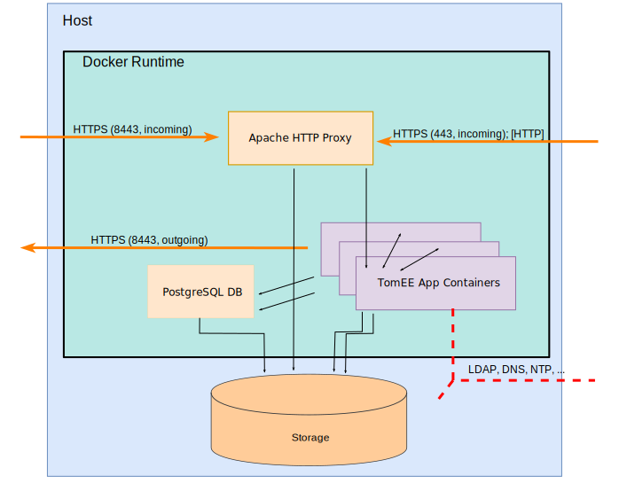

# Bausteinsicht
Dieses Kapitel beschreibt das System als eine Sammlung von Bausteinen (Module, Komponenten, Klassen, Intefaces, usw.) und ihre Beziehungen, beginnend mit der obersten Ebene (Top-Down). 

Die vorstehende Abbildung zeigt das vollständige Ökosystem der Leibniz Bioactives Cloud aus der Sicht eines Knotens. Die Pfeilrichtung zeigt immer an, aus von welchem Partner eine Verbindung aufgebaut wird. Insbesondere schließt die Darstellung die für die Initialisierung benötigten Komponenten mit ein. Bei den meisten auf dieser Ebene gezeigten Bausteinen handelt es sich um Standardkomponenten (z.B. Nutzer-PCs, normale Webserver, Software-Repositories usw.), die keiner weiteren Erläuterung oder Konfiguration bedürfen. In den folgenden Abschnitten sind daher nur die Bausteine

* **Knoten**
  Die Knoten sind die dezentralen Elemente der Leibniz Bioactives Cloud und stellen die Funktionen der Cloud zur Verfügung. Dieser Abschnitt vermittelt eine Übersicht, welche Komponenten in einem Knoten zusammenarbeiten. Auf die eigentliche Webanwendung wird aufgrund der besseren Übersicht in einem separaten Abschnitt eingegangen.
* **Entwickler-PC**
  Der Entwickler-PC erfüllt die Aufgabe, aus dem Quellcode im Source-Code-Repository und der vom Administrator bereitgestellten Konfiguration ein individualisieres Installationspaket zu erzeugen. Ausserdem ist auf diesem Gerät die Leibniz-Bioactives Cloud-CA lokalisiert, die eine zentrale Rolle bei der Absicherung der Cloud spielt.
* **Webanwendung**
 Die Webanwendung ist eine Java Enterprise Edition Webanwendung, die letztendlich das Zusammenspiel der Knoten in der Cloud als auch der Komponenten innerhalb des Knotens steuert und die den Anwendern die Services zur Verfügung stellt. Während die übrigen Komponenten weitgehend fremdgefertigt sind und daher als Blackbox betrachtet werden können, steckt der größte Teil der Entwicklungsarbeit in dieser Komponente.

## Bausteinsicht: Knoten
Die Cloud-Knoten in ihrer Gesamtheit bilden die Cloud. Jeder Knoten setzt sich aus verschiedenen Bestandteilen zusammen, um die benötigten Funktionen ausführen zu können. Die Cloud-Knoten sind weitgehend gleichberechtigt; ein Knoten fungiert jedoch als Master-Knoten und verteilt die Liste der bekannten Knoten.

Die Grafik zeigt eine schematische Darstellung eines Knotens mit den Beziehungen der Bestandteile untereinander und den Verbindungen nach außen. Verbindungen (insbesondere des Basissystems zu öffentlichen Repositorien), die nur einmalig während der Installation bzw. für Updates notwendig sind, sind nicht dargestellt. Die einzelnen Bestandteile werden nachfolgend beschrieben:

* Basissystem
* Storage
* PostgreSQL-Datenbank
* Proxy (Apache HTTP Server)
* Solr
* TomEE (Web Application Server)

Darüberhinaus wird der im TomEE Web Application Server laufenden Java-Web-Anwendung ein eigener Abschnitt gewidmet.

### Basissystem
Das Basissystem besteht aus einem Linux-Server in Minimalkonfiguration, der um folgende Softwarepakete (zuzüglich eventueller Abhängigkeiten) ergänzt wurde:

* Docker und Docker Compose (ab Docker Version 1.12)
* Dialog (NCurses-Dialoge für Shell-Skripte)
* cron
* ed (Zeileneditor)
* GnuZip
* M4 Makroprozessor
* OpenSSL
* sshd (nur falls Remote-Administration gewünscht wird)
* sudo
* tar
* sharutils (uuencode / uudecode)
* wget

Java ist auf dem Basissystem nicht erforderlich.

Ein Teil der Entwicklung der Leibniz Bioactives Cloud erfolgt unter OpenSUSE Leap 15.1 (Stand Mrz. 2020). Die Architektur ist jedoch weitgehend distributionsunabhängig; die Auswahl einer Distribution wird dem lokalen Administrator überlassen.

#### Init-System
Momentan unterstützt das Installationsskript vorrangig Systeme mit Systemd-Initsystem. Das traditionelle SystemV-Init kann ebenfalls noch ausgewählt werden, die Testabdeckung ist jedoch schlechter.

#### Härtung
Es wäre wünschenswert, das System durch Erweiterungen wie beispielsweise SELinux gegen Angriffe zur härten. Bislang wurden noch keine Aktionen in diese Richtung unternommen.

#### Performance
Die Docker-Performance und insbesondere der Speicherplatzbedarf sind von verwendeten Docker-Storage-Subsystem abhängig. Siehe nachfolgenden Abschnitt: Storage.

### Storage
Beim Speichersubsystem des Knotens handelt es sich um ein einfaches Verzeichnis in einem normalen Linux-Dateisystem (XFS, Ext4, ...). Das SOLR-Handbuch warnt ausdrücklich davor, den Speicher als Netzwerkdateisystem (z. B. NFS oder CIFS) zur Verfügung zu stellen. Entsprechende Empfehlungen existieren auch für PostgreSQL. Unsere Empfehlung lautet daher, den Speicher als internen Plattenspeicher, DAS oder SAN-Speicher zur Verfügung zu stellen.

> **Tip:**
> _Um spätere Erweiterungen des Speicherplatzes zu erleichtern, sollte das Verzeichnis für die Cloud-Daten in einem separaten Dateisystem mit darunterliegendem Volume-Management angelegt werden. Über die Natur dieses Managements (LVM, ZFS, Feature des SAN-Systems) werden keine Annahmen getroffen. Für den Anfang kann zunächst auch in der Root-Partition des Knotens gearbeitet werden._

> **Tip:**
> _Sollte NFS die einzig mögliche Speicheroption sein, so empfehlen wir dringend, das NFS-Volume mit den Optionen sync und hard zu mounten, um möglichst weitreichende Konsistenzgarantien zu erhalten._

Der Speicherort der Cloud-Instanz wird während der Konfiguration festgelegt und in der Datei `~/.lbac` gespeichert. Während der eigentlichen Installation wird eine gleiche Datei (`/root/.lbac`) für den Nutzer root erzeugt, auf die durch die Init-Scripte zugegriffen wird. Durch die Datei wird die Variable `$LBAC_DATASTORE` definiert, die den absoluten Pfad zum eigentlichen Speicherort der Cloud-Instanz definiert.

#### On Disk Layout
Während der Konfiguration und anschließenden Installation werden in dem von der Variable `$LBAC_DATASTORE` bestimmten Speicherort folgende Verzeichnisse erzeugt:

* `backup/`
  Backups und Datenbank-Dumps
* `bin/`
  Für diverse Skripte (Installation, Backup, ...).
* `data/`
  Die Daten der Cloud (Dokumente, SOLR-Indices, PostgreSQL-Datenbanken usw.); unterhalb von /data werden entsprechend Unterverzeichnisse erzeugt:
  - `data/db/`
  - `data/solr/`
  - `data/ui/`
* `dist/`
  Die Softwaredistribution (Bibliotheken, WAR-Dateien, Konfiguration der Docker Container, usw.). Aus diesem Verzeichnis werden die Docker-Container instantiiert.
* `etc/`
  Das Verzeichnis `etc/` enthält Konfigurationsdaten, Zertifikate, Credentials usw. die bereits mit dem Konfigurationsskript erfasst bzw. erzeugt werden. Im Verlauf der Installation wird ein Großteil dieser Daten in das Verzeichnis `dist/etc/` kopiert.
* `tmp/`
  Das Verzeichnis tmp/ steht für temporäre Speicherung zur Verfügung. Während der Installation bzw. bei Updates wird dort das Installationspaket gespeichert. Ebenso speichert das Installationsskript das Logfile in diesem Verzeichnis.

#### Docker Storage
Die Standardkonfiguration des Docker-Storage-Subsystems (Verwendung eines Loop-Device) ist extrem ineffizient: Erstens wird der einmal von der Loop-Datei allozierte Speicher nicht mehr freigegeben, auch wenn die enthaltenen Volumes, Container und Images gelöscht werden. Dadurch können substanzielle Bereiche des Plattenspeichers dauerhaft blockiert werden. Zweitens ist die Verwendung eines Loop-Device die langsamste Variante. Es empfiehlt sich daher, die Standard-Einstellung des Docker-Storage-Treibers zu ändern. Am IPB liegen Erfahrungen mit dem overlay2-Treiber vor, bei dem Teile des Host-Dateisystems  per bind-mount in die Container eingeblendet werden. Dazu muss der Docker-Daemon mit der zusätzlichen Kommandozeilenoption "-s overlay2" gestartet werden.

Erfahrungen mit BTRFS, ZFS oder einem LVM thin pool im Zusammenhang mit Docker liegen am IPB bislang nicht vor, da das Root-Filesystem unserer Hosts standardmäßig mit XFS formatiert wird und unseren Hosts darüberhinaus keine weiteren Storage-Ressourcen zur Verfügung stehen.. 

### PostgreSQL
Die Konfiguration des PostgreSQL-Containers ergänzt das offizielle Docker-Image um das Plugin pgChem:Tigress (zukünftig ist die zusätzliche Integration von RDKit geplant). Die Datenbankdateien werden im Datenverzeichnis des Knotens unterhalb von `$LBAC_DATASTORE/data/db` gespeichert. Sofern das Datenverzeichnis noch nicht initialisiert wurde, erfolgt die Initialisierung durch SQL-Skripte, die in der Build-Phase unterhalb von /docker-entrypoint-initdb.d abgelegt werden und die Initialisierung der Datenbank beim Hochfahren des Containers übernehmen. Die Initialisierungsdateien sind numerisch geordnet, so dass im Verlauf der Entwicklung anfallende Änderungen am Datenbankschema ggf. nachvollzogen werden können. Die Datenbank selbst speichert die Schema-Version in der Tabelle `info`, so dass bei Versions-Updates fehlende Schemaänderungen erkannt werden. 

Aus der Webanwendung wird über Hibernate auf die Datenbank zugegriffen. Es hat sich gezeigt, dass aufgrund der Komplexität der Datenstrukturen und der vielfältigen Verknüpfungen (lokal und remote), innerhalb der Anwendung eine Zwischenschicht, nämlich Datatransferobjekte, eingeführt werden mussten. 

Das Backup der Datenbank sowie Datenbank-Dumps vor Softwareupdates müssen extern organisiert werden. Beide Funktionen werden vom Skript `$LBAC_DATASTORE/bin/backup.sh` wahrgenommen, dass auch die Sicherung der übrigen Datenquellen (Solr, ui) übernimmt. Der Aufruf erfolgt entweder durch CRON oder während der Installation durch das Setup-Skript. Die Sicherung erfolgt in das Verzeichnis `$LBAC_DATASTORE/backup`. 

Die Datenbank wird momentan nicht im ArchiveLog-Modus betrieben.

#### Debugging
Normalerweise ist die Datenbank nur innerhalb des privaten Netzes (`lbac_private`) des Container-Hosts erreichbar. Durch die Installations-Option "`--debug`" kann man erreichen, dass die Datenbank auch von außerhalb erreichbar ist. Dies stellt ein Sicherheitsrisiko dar und sollte im Produktivbetrieb daher unterbleiben.

### Proxy
Der Baustein "Proxy" empfängt alle eingehenden Anfragen, übernimmt die Entschlüsselung und Zertifikatsprüfung sowie eine erste Zulässigkeitsprüfung der angefragten URL. In den Standardeinstellungen kommt ein Container mit Apache httpd 2.4 für diesen Zweck zum Einsatz. Externe Zugriffe werden vom Proxy auf folgende URLs beschränkt:

* `https://$LBAC_INTERNET_FQHN:8443/ui/rest/*` 
* `https://$LBAC_INTERNET_FQHN:8443/ui/servlet/document` 

Der Wert der Variable `$LBAC_INTERNET_FQHN` ergibt sich aus der Konfigurationsdatei `$LBAC_DATASTORE/etc/config.sh`.

#### Zertifikatsprüfung
Externe Verbindungen werden durch gegenseitige zertifikatsbasierte Authentifizierung abgesichert. Die Prüfung der Zertifikate der Gegenstellen erfolgen mittels einer Zertifikatssperrliste (Certificate Revocation List; CRL), die durch einen Cron-Job auf dem Docker-Host regelmäßig aktualisiert wird. Die Einrichtung des Cron-Jobs erfolgt während der Installation. Für interne Verbindungen findet auf dem Proxy keine solche gegenseitige Authentifizierung statt.

#### Externer Proxy
Optional kann anstelle des Proxy-Containers ein externer Proxy eingesetzt werden. Der Vorteil eines externen Proxies kann in erweiterten Sicherheitsfunktionen (z.B. Deep Packet Inspection) liegen, die z.B. die Verbreitung von Malware oder den Einbruch in das System verhindern. Die Entscheidung für oder gegen einen externen Proxy wird normalerweise durch das Konfigurationsskript abgefragt. Es ist jedoch möglich, bei der Installation von dieser Voreinstellung abzuweichen. Das Installationsskript akzeptiert hierzu folgende Optionen:

* `--proxy`: Unabhängig von der Konfigurationseinstellung wird ein Proxy-Container eingerichtet
* `--noproxy`: Unabhängig von der Konfigurationseinstellung muß ein externer Proxy konfiguriert sein 

Der externe Proxy muss jedoch manuell konfiguriert werden; das Installationsskript kann diese Aufgabe nicht erfüllen. Da die unterschiedlichsten Systeme zum Einsatz kommen können, kann das Handbuch keine konkrete Hilfe anbieten. Die nachfolgenden Ausschnitte aus den Konfigurationsdateien des Apache httpd 2.4 mögen als Orientierungshilfe dienen:

**Interne Verbindungen**

    <VirtualHost _default_:443>
        ServerName LBAC_INTRANET_FQHN:443
        ServerAdmin LBAC_MANAGER_EMAIL
        DocumentRoot "/usr/local/apache2/htdocs"
     
        SSLEngine on
        SSLCertificateFile "/usr/local/apache2/conf/official_cert.pem"
        SSLCertificateKeyFile "/usr/local/apache2/conf/official_cert.key"
     
        <IfModule mod_proxy.c>
            ProxyPass         /ui/websocket/search  ws://ui:8080/ui/websocket/search
            ProxyPass         /ui                   http://ui:8080/ui
            ProxyPassReverse  /ui                   http://ui:8080/ui
        </IfModule>
    </VirtualHost>

**Externe Verbindungen**

    <VirtualHost _default_:8443>
        ServerName LBAC_INTERNET_FQHN:8443
        ServerAdmin LBAC_MANAGER_EMAIL
        DocumentRoot "/usr/local/apache2/htdocs"
     
        SSLEngine on
        SSLCertificateFile "/usr/local/apache2/conf/lbac_cert.pem"
        SSLCertificateKeyFile "/usr/local/apache2/conf/lbac_cert.key"
     
        # Certificate Revocation Lists (CRL):
        SSLCARevocationCheck chain
        SSLCARevocationPath "/usr/local/apache2/conf/crl/"

        SSLVerifyClient require
        SSLVerifyDepth 3
     
        SSLCACertificatePath "/usr/local/apache2/conf/crt/"

        <IfModule mod_proxy.c>
            ProxyPass         /ui/rest              http://ui:8080/ui/rest
            ProxyPassReverse  /ui/rest              http://ui:8080/ui/rest
            ProxyPass         /ui/servlet/document  http://ui:8080/ui/servlet/document
            ProxyPassReverse  /ui/servlet/document  http://ui:8080/ui/servlet/document
        </IfModule>
    </VirtualHost>

Die vom Proxy benötigten Zertifikate und Schlüssel werden bei der Installation im Verzeichnis `$LBAC_DATASTORE/dist/etc` abgelegt.

> **Achtung:**
> _Die Gültigkeit der Zertifikatssperrliste ist auf wenige Tage beschränkt. Die Zertifikatssperrliste (CRL) muss deshalb täglich aktualisiert werden. Die aktuelle Zertifkatssperrliste kann jeweils unter der URL `$LBAC_DISTRIBUTION_POINT/crl.pem` heruntergeladen werden. Der Wert der Variable `$LBAC_DISTRIBUTION_POINT` kann der Konfigurationsdatei `$LBAC_DATASTORE/etc/config.sh` entnommen werden._

### SolR
Der Baustein Solr übernimmt die Indexierung (und zukünftig semantische Annotation) der Dokumente. Die Dokumenten werden dabei über den `/update/extract`-Mechanismus in Solr hochgeladen. Dabei durchlaufen sie eine komplexe Analyse-Pipeline. Zunächst wird mit Apache Tika eine Konvertierung der unterschiedlichen Formate (PDF, Microsoft .doc, ...) in einen Textstream vorgenommen. Anschließend werden die relevanten Informationen durch Sprachanalyse, Tokenizing, Stemming, Stoppwort-Filterung und ggf. weitere Schritte bestimmt. Schließlich wird ein Index erzeugt, der Text gespeichert und ein Termvector erzeugt. Die exakte Abfolge der Analyseschritte und die gespeicherten Daten und Metadaten wird durch die Dateien solrconfig.xml und managed-schema (sowie damit verbundene Stoppwort-Listen usw.) gesteuert.

Ein Problem stellte die Analyse und Speicherung von Dokumenten in mehreren Sprachen (mit der Vereinfachung: eine Sprache pro Dokument!) dar, da dieser Fall in SolR nach unserem Verständnis schwierig zu handhaben ist. Bei der Abarbeitung der Analysepipeline werden die (Text-)Daten sprachabhängig in unterschiedlichen Feldern gespeichert, z. B. `text_en`, `text_de` usw. Dies führt zur Abfragezeit dazu, dass Termvektoren, Textpositionen usw. aus verschiedenen Feldern zusammengesucht werden müssen. Die Speicherung in einem gemeinsamen Feld (z.B. `_general_`) ist nicht möglich, es sei denn, man verzichtet bei der Analyse (Stemming, Stopwort-Filterung, ...) auf sprachspezifische Eigenheiten. Das führt aber zu häßlichen Artefakten und unbrauchbaren Suchergebnissen in der *Word Cloud Suche*. Perspektivisch ist daher geplant, SolR durch eine andere Lösung zu ersetzen. Die Ersatzlösung wird dabei voraussichtlich schlechter skalieren als SolR; dessen Leistungsfähigkeit ist im von uns anvisierten Einsatzszenario jedoch bei weitem überdimensioniert.

### TomEE
Die spezifische Anwendungslogik der Leibniz Bioactives Cloud befindet sich größtenteils in der Webanwendung ui, die vom Baustein "TomEE Web Application Server" gehostet wird. Beim TomEE Web Application Server handelt sich um einen Docker-Container mit "Apache TomEE Plume", der seinerseits als JavaEE Container für die Webanwendung fungiert. Die Konfiguration des Docker-Containers stützt sich auf das offizielle TomEE-Plume Image (Stand 2020-03-12: `tomee:8-jre-7.1.0-plume`) und modifiziert dieses wie folgt:

*  Hinzufügen einiger zusätzlicher Java-Bibliotheken, v.a. PostgreSQL-JDBC und Hibernate
*  Löschen der Default-Webapps (manager, docs, ...)
*  Installation bzw. Ersetzen von tomee.xml und tomcat-users.xml
*  Installation der Keystores und Truststores für zertifikatsbasierte Authentifizierung und verschlüsselte Kommunikation
*  Erstellen eines unpriviligierten Nutzers tomee mit uid 8080 und einer Gruppe tomee mit gid 8080
*  Installation der Leibniz Bioactives Cloud Webapp (ui.war)

Als Enterprise Java Web Application Server stellt TomEE mithilfe von Hibernate die transaktionskontrollierte Persistierung der Java-Objekte sicher. Im Laufe der Entwicklung hat sich gezeigt, dass die Datenbankcredentials dafür am besten in der globalen Konfigurationsdatei tomee.xml hinterlegt werden. Die DataSource-Konfiguration für Hibernate innerhalb der Webanwendung (über hibernate.cfg.xml) hat sich demgegenüber nicht bewährt.

