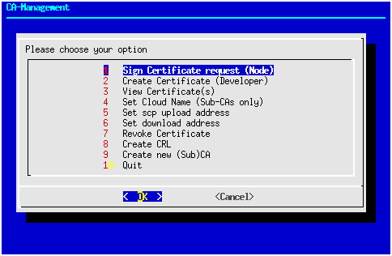

## Entwickler-PC
Auf dem Entwickler-PC sind mehrere Komponenten vereint:

* ein Clon des CRIMSy Git-Repository 
* ein Entwicklungssystem (mindestens Maven und JDK)
* OpenSSL und das camgr.sh-Skript aus dem Repository zur Verwaltung der CA
* etwas Speicher zur persistenten Speicherung der Konfiguration und der Zertifikate

### camgr.sh
Viele Funktionen der Cloud werden über Zertifikate abgesichert. Mit dem Skript `util/bin/camgr.sh` kann diese Public Key Infrastruktur (PKI) verwaltet werden. Die funktionen des Skripts sind im einzelnen:

* die Erzeugung der Root-CA
* die Erzeugung und Ausstellung von Zertifikaten für Sub-CAs
* die Ausstellung von Zertifikaten für die Maschine-zu-Maschine-Kommunikation
* die Ausstellung von Entwicklerzertifikaten für Codesigning und (Email-)Verschlüsselung
* die Anzeige der momentan gültigen Zertifikate
* der Widerruf von Zertifikaten und die Erstellung einer Certificate Revocation List
* die Festlegung des Code Distribution Point (d.h. Download-URL für die Installationspakete und Updates)
* die Erstellung von Java-Truststores mittels des keytool-Utility der JRE

Einige Funktionen des Scripts können interaktiv über Menü genutzt werden:

Einige Funktionen (z.B. die Erzeugung von Zertifikaten für die Maschine-zu-Maschine-Kommunikation) sind auch über Kommandozeile zugänglich. Das Skript stellt dabei im wesentlichen einen Wrapper für OpenSSL dar und legt bestimmte Konfigurationsparameter für OpenSSL fest (z.B. Schlüssellänge, Digest-Algorithmus, Gültigkeitszeitraum, Key Usage usw.).

#### On Disk Layout
Das Skript `camgr.sh` erwartet seine Konfigurationsdaten im Verzeichnis `config/CA/` (Root-CA) bzw. `config/CLOUD_NAME/CA` (Cloud-CA), relativ zu einem Checkout des CRIMSy Git-Repositories: 

    + config/
      + CA/
        + certs/
        + crl/
        + devcert/
        + lbac/
        + req/
        + ca.cfg
        + cloud.cfg
        + index.cloud
        + index.txt
        + cacert.key
        + cacert.passwd
        + cacert.pem
        + serial.txt
        + [...]
    + util/
      + bin/
        + camgr.sh

#### Kommandozeile
Das Skript kann mit Kommandozeilenoptionen aufgerufen werden, um:

* eine Certificate Revocation List (CRL) zu erzeugen und sie zum Distributions-Server hochzuladen
* einen Certificate Request zu signieren
* einen Truststore zu erzeugen

Eine Übersicht über die verfügbaren Kommandozeilenparameter erhält man mit der Option `--help`.

