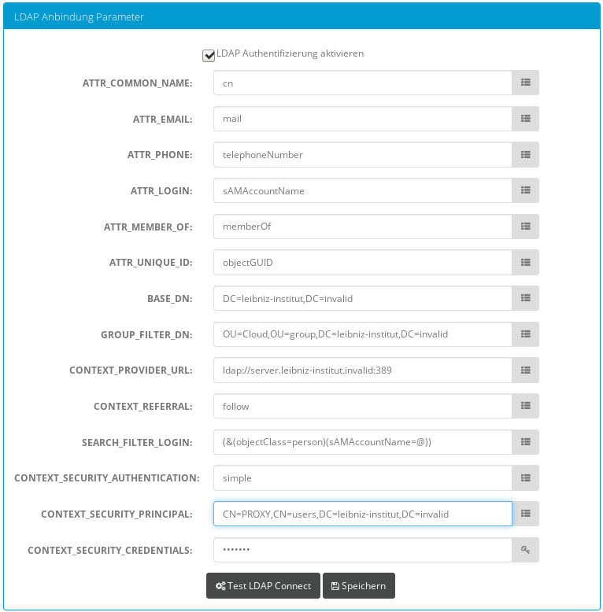

Webanwendung
------------
Die Webanwendung im TomEE-Container ihrerseits läßt sich wiederum in folgende Bestandteile gliedern:

* Konfigurationsdaten der Webanwendung (Verzeichnisse WEB-INF, META-INF, ...)
* statische Ressourcen (Icons, CSS-Dateien, Javascript-Bibliotheken, ...)
* Templates für das Rendering der (X)HTML-Seiten
* Geschäftslogik in Form von Java-Klassen

Zur Buildtime kommen hierzu noch Unit-Tests zur Qualitätssicherung. Alternativ besteht die Webanwendung in folgende Funktionskomponenten:

* Nutzer- und Berechtigungsverwaltung
* Verwaltung lokaler Ressourcen (Collections, ...)
* Cloud-weite Synchronisierung der Ressourcen
* Daten-Upload
* Verteilte Suche (Simple Search, Word Cloud Search) und Document Delivery (Downloads)

Während einige Inhalte der Leibniz Bioactives Cloud innerhalb der teilnehmenden Institutionen frei zugänglich sein sollen, ist für andere Ressourcen (Dokumente, Daten, Services) eine Zugriffsbeschränkung notwendig. In jedem Fall darf die Änderung administrativer Einstellungen oder das Hochladen von Dokumenten nur für autorisierte Benutzer möglich sein. Um einerseits eine feingranulare Steuerung und andererseits eine bequeme Verwaltung zu ermöglichen, gibt es im System folgende Objekte bzw. Interfaces (für Details siehe Java-Dokumentation):

* Nutzer (`User`)
* Gruppen (`Group`); Gruppen können sowohl Nutzer als auch Gruppen als Mitglieder (`Membership`) haben.
* Access Controlled Objects (Interface `ACObject`); alle Objekte die Zugriffsbeschränkungen erweitern diese abstrakte Klasse
* Permissions (`enum ACPermission`) regeln die Art des erlaubten Zugriffs (Lesen, Anlegen, Ändern, Löschen, Eigentum Übertragen, ...)
* Access Control Entries (`ACEntry`); legen die Zugriffsberechtigung für einen Nutzer bzw. eine Gruppe fest
* Access Control Lists (`ACList`); sammeln alle Access Control Entries für eine Access Control List. 

Ein Großteil der Programm-Logik zu diesem Thema ist in der Java-Package `de.ipb_halle.lbac.admission` gebündelt.

Verwaltung von Nutzern und Gruppen 
^^^^^^^^^^^^^^^^^^^^^^^^^^^^^^^^^^
`User` und `Group` sind konkrete Implementierungen der abstrakten Klasse `Member`. Diese Struktur wurde gewählt, damit bei der Berechtigungsprüfung nicht zwischen Berechtigungen für Nutzer und Berechtigungen für Gruppen unterschieden werden muss. Außerdem war ein Ziel, verschachtelte Mitgliedschaften (*nested group memberships*) zu ermöglichen, wie sie von LDAP / Active Directory bekannt sind.  Dies bedeutet, dass Gruppen ihrerseits Mitglieder von Gruppen sein können; die Mitgliedschaften einer Gruppe vererben sich auf ihre Mitglieder. Da die effektiven Mitgliedschaften eines Nutzers bei jeder Berechtigungsprüfung benötigt werden, muss die Bestimmung der effektiven Mitgliedschaften effizient sein. In komplexeren Szenarien kann eine verschachtelte Mitgliedschaft zudem auf verschiedenen Pfaden zustande kommen, bspw. wenn zwei Gruppen A und B Mitglied in einer Gruppe C sind. Ein Nutzer der sowohl Mitglied in Gruppe A als auch B ist, erbt die Mitgliedschaft in Gruppe C also doppelt. Eine genaue Buchführung über die effektiven Mitgliedschaften ist in solchen Fällen also unerläßlich.

Bei den Nutzern und Gruppen werden dabei aktuell vier verschiedene Typen unterschieden:

.. tabularcolumns:: |l|p{8cm}|

+----------+------------------------------------------------------+
| Typ      | Beschreibung                                         |
+==========+======================================================+
|`BUILTIN` | vordefinierte Nutzer und Gruppen,                    |
|          | z.B. `Public Account`; keine Änderungen möglich      |
+----------+------------------------------------------------------+
|`LOCAL`   | lokale Nutzer und Gruppen des Knotens                |
+----------+------------------------------------------------------+
|`LDAP`    | lokale Nutzer und Gruppen aus einem LDAP-Verzeichnis |
+----------+------------------------------------------------------+
|`REMOTE`  | remote Nutzer, d.h. Nutzer eines anderen Knotens     |
+----------+------------------------------------------------------+

.. todo:: *Der Typ `REMOTE` heißt momentan noch `LBAC_REMOTE`; dies sollte durch Refactoring behoben werden.*

Schwierigkeiten ergeben sich daraus, dass die Verwaltung dieser Objekte nicht nur auf dem lokalen Knoten erfolgen muss, sondern dass insbesondere die Information über Nutzer und Gruppen(mitgliedschaften) auch auf anderen Knoten der Cloud vorliegen muss. Zur Sicherstellung der Konsistenz gibt es daher Regeln, zwischen welchen Nutzer- bzw. Gruppentypen Mitgliedschaften eingerichtet werden können:

.. tabularcolumns:: |l|l|l|l|l|

+--------------------+-------------+-----------+----------+------------+
| X Mitglied in Y?   | Y=`BUILTIN` | Y=`LOCAL` | Y=`LDAP` | Y=`REMOTE` |
+====================+=============+===========+==========+============+
| X = `BUILTIN`      | Auto        | Nein      | Nein     | Nein       |
+--------------------+-------------+-----------+----------+------------+
| X = `LOCAL`        | Auto        | Ja        | Nein     | Nein       |
+--------------------+-------------+-----------+----------+------------+
| X = `LDAP`         | Auto        | Ja        | Auto     | Nein       |
+--------------------+-------------+-----------+----------+------------+
| X = `REMOTE`       | Auto        | Ja        | Nein     | Auto       |
+--------------------+-------------+-----------+----------+------------+

.. note::  *Es ergibt z.B. keinen Sinn, einer LDAP-Gruppe weitere Mitglieder hinzuzufügen, da Mitgliedschaften dieser Gruppe ausschließlich im LDAP verwaltet werden sollen.*

Ein Administrator kann also nur zu Gruppen vom Typ LOCAL Mitglieder hinzufügen. Andere Mitgliedschaften werden entweder automatisch verwaltet oder sind prinzipiell ausgeschlossen.

Zur weiteren Vereinfachung ist die Authentifizierung von Nutzern auf den lokalen Knoten beschränkt. Ein Nutzer (egal ob knoteneigener Nutzer oder LDAP) kann sich nur an seinem Heimatknoten anmelden. Die Anmeldung von Nutzern externer Knoten wird nicht unterstützt. Falls in den Systemeinstellungen nichts anderes bestimmt wurde, kann der Knoten auch ohne Anmeldung genutzt werden. In diesem Fall werden alle Aktionen mit dem `Public Account` durchgeführt. Mit der Anmeldung eines Nutzers erfolgt die (asynchrone) Übertragung der Nutzer- und Gruppeninformationen zu den übrigen Knoten. Knoten, von denen mehrere Cloud-Mitgliedschaften bekannt sind, werden nur einmal kontaktiert. Gruppenmitgliedschaften werden dabei "flach", d. h. ohne Verschachtelung, übertragen. Soweit auf dem empfangenden Knoten weitere Mitgliedschaften bestehen, kann es jedoch wieder zu einer Verschachtelung kommen. Der sendende Knoten stellt sicher, dass keine sensitiven Informationen (Passworthashes) gesendet werden, der empfangende Knoten stellt sicher, dass keine lokal gemanagten Entitäten überschrieben werden. Die entsprechenden Entitäten implementieren hierzu das Interface `Obfuscatable`. Außerdem führt der empfangende Knoten eine Sicherheitsfilterung durch und akzeptiert nur Nutzer- oder Gruppenobjekte vom sendenden Knoten. Dadurch werden einerseits die Mitgliedschaftsregeln nach obiger Tabelle sichergestellt und andererseits unterbunden, dass Objekte von Drittknoten beeinflusst werden und die Komplexität der Nutzerverwaltung unbeherrschbar wird.

Ein schwerwiegendes Problem stellt das Löschen von Nutzern oder Gruppen dar, da andere Objekte - auch auf entfernten Knoten - direkt oder indirekt davon abhängen (referentielle Integrität). Zudem könnte ein entfernter Knoten zum Löschzeitpunkt vorübergehend nicht erreichbar sein. Aus diesem Grund werden Objekte nicht gelöscht sondern lediglich deaktiviert und unsichtbar geschaltet. Evtl. könnte dies über ein Ablaufdatum erfolgen.

.. note:: *Die `obfuscate()`-Methode könnte entweder durch eine Annotation ersetzt werden oder als Implementierung eines Interfaces formalisiert werden. Die Nutzung der `@Transient`-Annotation bzw. des `transient`-Keywords ist leider nicht zielführend. Das Problem liegt darin, dass die sensitiven Daten lokal persistiert und ggf. auch für lokale Browser / Administratoren serialisiert werden müssen, andererseits die lokale Einrichtung jedoch nicht in serialisierter Form verlassen dürfen.*

Anbindung von LDAP-Verzeichnissen
"""""""""""""""""""""""""""""""""
Ein Knoten der Cloud soll sich möglichst reibungslos in die vorhandene IT-Infrastruktur einer Betreiberinstitution integrieren. Dazu gehört die Anbindung an vorhandene Nutzerverzeichnisse (Active Directory oder andere LDAP-Server). Den lokalen Administratoren soll damit die erspart werden, eine weitere Datenbank mit Nutzerinformationen zu pflegen. 

Die Verbindungsparameter werden über den gezeigten Dialog eingestellt. Für die Eingabefelder existieren kleine Tooltips, die kurze Hinweise zum jeweiligen Feld geben. Besonders erwähnenswert sind vor allem die Parameter `ATTR_UNIQUE_ID` und `GROUP_FILTER_DN`. Mit ersterem wird die sichere Zuordnung von Nutzern zu Ihrem Konto gewährleistet, auch wenn sich zwischenzeitlich das Login-Kennzeichen (z.B. wegen Namensänderung infolge Heirat, Scheidung, ...) ändert. Der zweite Parameter sorgt dafür, dass nur ein Teil der Gruppen aus dem LDAP-Verzeichnis in der Cloud sichtbar sind, nämlich jene, welche sich unterhalb der `GROUP_FILTER_DN` befinden. Dies ist aus Sicherheits- und Datenschutzgründen erforderlich, da den Cloud-Teilnehmern ansonsten die komplette Gruppenstruktur offenbart würde.

Verwaltung von Berechtigungen
^^^^^^^^^^^^^^^^^^^^^^^^^^^^^
Access Controlled Objects implementieren das Interface `ACObject`, das diesen Objekten einen Besitzer und eine Access Control List zuweist. Access Controlled Objects (z.B. Collections) werden nur zur Laufzeit ausgetauscht und nicht in der Datenbank des Systems persistiert (siehe auch Kapitel "Laufzeitsicht"). Sie stehen dem jeweils angemeldeten Nutzer im Rahmen seiner Session zur Verfügung. Damit wird die Menge der zu synchronisierenden Daten begrenzt. Eine Persistierung würde ansonsten die Synchronisierung aller verbundenen Objekte (ACLs, Nutzer, Gruppen, ggf. Mitgliedschaften) erfordern. Dies würde die Komplexität massiv erhöhen und ist deswegen nicht erwünscht. Der Abruf der Access Controlled Objects erfolgt, nachdem die Nutzerdaten übertragen wurden. Damit ist sichergestellt, dass die für den Nutzer zum aktuellen Zeitpunkt effektiven Berechtiungen angewendet werden. Im Übrigen verfolgt die Leibniz Bioactives Cloud das Konzept der eventuellen Konsistenz, d. h. Berechtigungsänderungen die während der Laufzeit einer Session vorgenommen werden, werden erst bei der nächsten Anmeldung berücksichtigt. Dies schließt ein, dass ein Nutzer Zugriff auf Ressourcen erlangt, für die Ihm der Zugriff kürzlich entzogen wurde.

Access Control Lists (ACLs, `ACList`) werden von Access Controlled Objects (`interface ACObject`) über ihre Id referenziert. Anders als bei Dateisystem-ACLs können mehrere Objekte eine ACL referenzieren. Das System stellt sicher, dass identische ACLs nicht mehrfach im System vorkommen. Um diese Aufgabe effizient zu erledigen, werden in Analogie zu `hashCode()` für jede ACL `permCode`s gepflegt, um den Vergleichsaufwand zu minimieren. Jede ACL besteht aus einem oder mehreren Access Control Entries (`ACEntry`), die für eine Gruppe oder einen Nutzer die Berechtigungen festlegen. Es werden lediglich positive Berechtigungen verwendet, die Berechtigungen der einzelnen ACEntries wirken additiv. Eine Besonderheit ist ein `ACEntry` für den `BUILTIN`-Benutzer `Owner Account`: dieser gibt die Berechtigungen für den Besitzer eines Objekts an.

