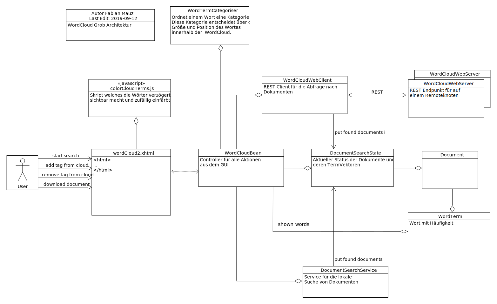

Laufzeitsicht
=============

Die dezentrale Organisation der Leibniz Bioactives Cloud bedingt eine hohe Nebenläufigkeit und damit auch Komplexität der ablaufenden Prozesse. Die einzelnen Prozesse können dabei nach folgenden Kriterien kategorisiert werden:

* Zeitpunkt der Ausführung: dauerhaft oder nur während Installation bzw. Update
* Ort der Ausführung: lokaler Knoten, Remote-Knoten oder andere
* automatische Ausführung oder auf Nutzeranforderung

Cookies und lokaler Speicher
----------------------------
Die Interaktion des Nutzers mit "seinem" Knoten erfordert regelmäßig die Zusammenfassung seiner Aktionen zu einer Session. Da HTTP / HTTPS zustandslose Protokolle sind, muss diese Zuordnung über Session-Cookies realisiert werden. Darüberhinaus werden Cookies bzw. lokaler Speicher dazu verwendet, die Konfiguration des Nutzerinterface (speziell Tabellen-Layout und -Sortierung) zu speichern. Gemäß https://ec.europa.eu/ipg/basics/legal/cookies/index_en.htm ist für diese technischen Cookies keine Einwilligung der Nutzer notwendig. Im Einzelnen handelt es sich um folgende Cookies:

+---------------+---------------------------------+-------------------------+
| Domain        | Cookie / Speicherschlüssel      | Zweck                   |
+===============+=================================+=========================+
| Cloud Host    | `JSESSIONID`                    | Sessionverwaltung       |
+---------------+---------------------------------+-------------------------+
| Cloud Host    | `serverTime`                    | Sessionverwaltung       |
+---------------+---------------------------------+-------------------------+
| Cloud Host    | `sessionExpiry`                 | Sessionverwaltung       |
+---------------+---------------------------------+-------------------------+

Prozessübersicht
----------------
Die nachfolgende Liste gibt eine Übersicht über die zur Laufzeit ablaufenden Prozesse. Zu jedem Prozess ist jeweils eine Kurzbeschreibung gelistet. Ausführliche Beschreibungen folgen im weiteren Verlauf in separaten Abschnitten.

* **Konfiguration:** Die Konfiguration dient der Erfassung von Informationen, die für die Installation und den Betrieb der Cloud notwendig sind. Für eine ausführliche Beschreibung des Konfigurationsprozess aus Administrator-Sicht wird auf das Handbuch "Konfiguration und Installation" verwiesen.
* **Installation:** Im Anschluss an die Konfiguration eines Knotens ist die Installation ein (i.d.R.) automatisch ablaufender Prozess, der lediglich vom Administrator angestoßen wird. Die Auslieferung von Softwareupdates erfolgt ebenfalls über diesen Prozess.
* **Backup:** Durch das Backup wird der lokale Knoten gegen Datenverlust abgesichert. Außerdem wird das Backup während des Updateprozess benötigt, falls es bei einem der Bausteine (inbes. PostgreSQL-Datenbank) zu einem Releasewechsel kommt. Sicherungskopien innerhalb des Knotens werden automatisch von einem Backup-Prozess angefertigt, der während der Installation eingerichtet wird. Die Einrichtung eines externen Backups ist die Aufgabe des lokalen Administrators. 
* **Suchanfragen:** Die Inhalte der vorhandenen Dokumente lassen sich durch Suchabfragen duchsuchen. Dazu wird auf jedem Node ein Index der lokalen Dokumente erzeugt. 
* **Wordcloudsuche:** Die Wordcloudsuche unterscheidet sich von einer normalen Suche durch die Visualisierung der prominentesten Stichworte, die in den Ergebnisdokumenten vorkommen.
* **Upload von Dokumenten:** Der Upload von Dateien wird durch eine Javascript - Komponente realisiert 
* **Download von Dokumenten:** Eine erfolgreiche Suchanfrage liefert eine Liste von Dokumenten, die auf verschiedenen Knoten der Cloud beheimatet sein können. Über einen Download-Link und entsprechende serverseitige Schnittstellen können einzelne Dokumente heruntergeladen werden.
* **Synchronisierung von Netzwerkressourcen:** Da es sich bei der Cloud um eine verteilte Infrastruktur handelt, müssen die Knoten Informationen über sich teilen und verbreiten. 
* **Authentifizierung, Nutzerverwaltung:** Diese Prozesse ermöglichen die Identifizierung von Nutzern und bilden die Basis für die feingranulare Verwaltung und Gewährung von Zugriffsrechten. 
* **Berechtigungsverwaltung:**
* **Collection-Verwaltung:** Das Collection Management ermöglicht das Anlegen, Ändern und Löschen von Collections und die Verwaltung der Zugriffsrechte.

Suchanfragen
^^^^^^^^^^^^
.. image: search_result.PNG
    :width: 80%
    :align: center
    :alt: Suchanfrage

Eine Suchanfrage wird parallel an alle verfügbaren Nodes der Cloud verteilt und ausgeführt. Jeder Node liefert als Ergebnis eine Liste mit Dokumenten, die im Browser Frontend zusammengeführt und dargestellt wird. Die Liste lässt sich anschliessend nach Spalten sortieren. 

.. note:: Die Indexierung der Dokumente erfolgt durch SolR; Syntax und Grammatik der Anfragen sind daher durch SolR vorgegeben. Die Implementierung der Wordcloudsuche und einer globalen Relevanzmetrik haben jedoch einige tiefgreifende Änderungen im Mechanismus der Anfrage-Behandlung erfordert. Einige der hier beschriebenen Abfrageoperationen funktionieren daher nicht mehr.

Eine Suchanfrage besteht grundsätzlich aus einem oder mehreren Suchbegriffen. Die zusätzliche Verknüpfung durch logische Operatoren ( AND, OR, NOT ) ist aktuell leider nicht mehr möglich.

Platzhalter
"""""""""""
Die Suchbegriffe können folgende Platzhalterzeichen (Wildcards), z.B. Fragezeichen (`?`) oder Asterisk (`*`) enthalten:

    **Beispiel:** `?`: der Suchbegriff `Te?t` liefert als mögliche Ergebnisse `Text`, `Test` usw.

    **Beispiel:** `*`: der Suchbegriff `Text*` liefert als mögliche Ergebnisse `Text`, `Texte`, `Texter`, `Textstelle` usw.

Unscharfe Suche (*fuzzy search*)
""""""""""""""""""""""""""""""""
Darüberhinaus kann man mit unscharfen Suchbegriffen operieren. Die unscharfe Suche basiert auf dem Levenshtein-Distanz Algorithmus. Der Suchbegriff besteht aus einem Wort gefolgt vom Tilde-Symbol. Zusätzlich läßt sich noch Schwellenfaktor zwischen 0 (ungenau) und 1 (sehr genau)  hinzufügen. Standard ist 0.5

    **Beispiel:** der Suchbegriff `Tier~` liefert als mögliche Ergebnisse auch `Tiere`, `Tor`, `Thor` oder auch `Hier`. Durch Angabe eines Gewichts kann die Toleranz des Algorithmus angepasst werden: `Tier~0.8`; der Standardwert beträgt 0.5

Nachbarschaftssuche (*proximity search*)
""""""""""""""""""""""""""""""""""""""""
mehrere Suchbegriffe, die in einem bestimmten Wortabstand zueinander stehen. Die Suchbegriffe werden durch doppelte Hochkomma eingeschlossen gefolgt durch das Tilde-Symbol und der Wortabstand.

    **Beispiel:** der Suchbegriff `"Analyse Chloroplasten"~2` liefert als mögliches Ergebnis eine Textstelle wie `Analyse in den Chloroplasten ..`

Wichtung der Suchbegriffe
"""""""""""""""""""""""""
Die Relevanz eines Suchbegriffes läßt sich Angabe eines Faktors erhöhen. Dazu wird der Suchbegriff mit `^` und einer Zahl versehen.

    **Beispiel:** der Suchbegriff `"arabidopsis thaliana"^4` `"Acker-Schmalwand"^2` liefert bevorzugt Ergebnisse mit `arabidopsis thaliana` 

Suche mit logischen Operatoren
""""""""""""""""""""""""""""""
mehrere Suchbegriffe lassen sich logische Operatoren miteinander verknüpfen (derzeit nicht möglich):

    **Beispiel:**
    Suchbegriff: `Analyse AND Chloroplast*` - liefert alle Dokumente, die beide Begriffe enthalten
    
    Suchbegriff: `Calcium  OR Phospor` - liefert alle Dokumente, die mindestens einen der beiden Begriffe enthalten
    
    Suchbegriff: `"arabidopsis thaliana" NOT 2013` - liefert alle Dokumente mit der Wortgruppe `arabidopsis thaliana`, aber ohne `2013`

Wordcloud-Suche
^^^^^^^^^^^^^^^

Eine Word Cloud ist eine Methode zur Informationsvisualisierung, bei der eine Liste aus Schlagwörtern, oft alphabetisch sortiert, flächig angezeigt wird, wobei einzelne unterschiedlich gewichtete Wörter größer oder auf andere Weise hervorgehoben dargestellt werden.

Dokumente enthalten je nach Thema fach- und themen-spezifische Begriffe. Diese Begriffe tauchen in einer gewissen Häufigkeit, auch in Kombination mit anderen Begriffen, im Dokument auf. Daraus lassen sich im gewissem Maße Rückschlüsse auf den Inhalt der Dokumente ziehen. Dokumente mit ähnlichen Begriffen und ähnlicher Häufigkeit behandeln eventuell gleichartigen Themen oder überschneiden sich wesentlich. Das soll als Anregung für den Nutzer dienen, um interessante Dokumente für sich zu finden.

Im Projekt LBAC soll eine *dynamisch* erzeugte Word Cloud als intuitive Möglichkeit dienen, um durch eine beliebige Menge von Dokumenten mit Hilfe von Schlagworten quasi zu navigieren. Jedes ausgewählte Schlagwort verfeinert/verändert die Ergebnismenge der Dokumente und liefert eine neue Word Cloud. Die Begriffe werden dabei logisch UND verknüpft. Ausgewählte Begriffe werden aus der Ergebnismenge entfernt (dive in). Der Nutzer hat die Möglichkeit bereits gewählte Suchbegriffe wieder zu löschen und sich somit rückwärts zu bewegen (dive out).

Frontend (View)
"""""""""""""""

Zur Darstellung der dynamischen Wordcloud wird die Komponente <p:tagCloud> aus der PrimeFaces Bibliothek genutzt. Aktuell werden bei einer initialen Suche die lokalen als auch alle remote Anfragen synchron durchgeführt und anschliessend die Cloud gerendert. Eine asynchrone Variante analog zu Dokumetensuche ist derzeit nicht implementiert.

Jedes Schlagwort ist als klickbarer Link dargestellt. Ein Klick auf das Schlagwort erzeugt eine neue Suchanfrage.  (dive in) Die Reihenfolge der geklickten Wörter wird in einer Tag-Liste dokumentiert. Die Tag-Liste ist klickbar. Ein beliebiges Tag kann hiermit gelöscht werden. (dive out). Die Word Cloud wird nach jeder Interaktion mit der neuen Ergebnismenge gezeichnet. Die Anzahl der Wörter wird begrenzt (top words) und kann über eine Auswahl (50,100,150) gewählt werden.

Controller (Klasse WordCloudBean)
"""""""""""""""""""""""""""""""""
Bei der Klasse handelt es sich um den Controller zum GUI. Folgende Methoden können vom Client angestoßen werden:

* `startSearch( )` - Startet die Suche mit den aktuellen Wörter in der Suchleiste
* `onSelect( SelectEvent event )` - Zeichnet eine neue Cloud mit den aktualisierten Terme und filtert nicht mehr relevante Dokumente aus
* `clearCloudState ( )` - Löscht alle Terme, die aktuelle Cloud sowie alle angezeigten Dokumente in der View
* `toggleWordCloudVisibility ( )` - Macht die Cloud sichtbar/unsichtbar
* `removeTag(String tag)` - Entfernt den übergebenen Tag, zeichnet die Cloud neu und aktualisiert die Dokumente

Darstellung von Wörtern in der Cloud
""""""""""""""""""""""""""""""""""""
Die Größe eines Wortes in der Cloud wird über dessen Kategorie bestimmt. 5 Kategorien existieren aktuell: `HIGHEST`, `HIGH`, `MEDIUM`, `LOW`, `LOWEST`. Die Kategorie eines Wortes wird über einen Algorithmus bestimmt. Die Einfärbung geschieht per Zufall aus 3 Farben.

**WordTermCategoriserComplex**

Bei diesem Algorithmus wird werden Wörter in hohe Kategorien einsortiert, welche die Anzahl der Dokumente nach Auswahl des Wortes möglichst halbieren und dennoch eine hoche Frequenz aufweisen.

$$score_T = (0.5 - | {D_T \over D} - 0.5|) * F_T$$

+----------+-------------------------------------------+
| Variable | Bedeutung                                 |
+==========+===========================================+
| $D_T$    | Dokumente mit dem Begriffsterm T          |
+----------+-------------------------------------------+
| $F_T$    | Anzahl des Begriffs T in allen Dokumenten |
+----------+-------------------------------------------+
| $D$      | Gesamtanzahl der Dokumente                |
+----------+-------------------------------------------+

Datenbank-Support
"""""""""""""""""
Nach der Erzeugung des Termvector, was automatisch mit dem Upload des Dokumentes zum Solr erfolgt, wird der Termvector im JSON-Format gelesen und als zusätzliche Meta-Information zum Dokument in der Datenbank-Tabelle files im Feld termvectors abgespeichert. Das Feld ist vom Datentyp jsonb. Das wird aus Performance-Gründen getan, da die Aggregation und Sortierung der Schlagwörter mehrerer Termvectoren direkt auf der Datenbank dank JSON-Unterstützung (Index GIN, lateral joins & spezielle Operatoren)  erfolgen kann. Im Controller wird nur das Endergebnis (Topliste der Schlagwörter) weitergereicht.

Folgende SQL-Anweisung aggregiert und sortiert die Termvectoren der gefundenen Dokumente zu einem Vector. Dabei wird von der JSON-Unterstützung des Postgres-Servers Gebrauch gemacht.  Ein direkter Abruf des Termvectors vom Solr-Server wäre möglich, müsste aber anschließend in Java aufwendig weiter verarbeitet werden. 
::

        SELECT
          tv.key as word,
          SUM(CAST((tv.value->>'tf') AS BIGINT)) as wc
        FROM files
           cross join lateral jsonb_each(termvectors) tv
        WHERE id in ( IDs der Dokumente )
        GROUP by tv.key
        ORDER by wc desc

Für den JSON-Support im Hibernate Umfeld mussten neue Spalten-Typen registriert werden. Siehe dazu `de.ipb_halle.lbac.cloud.hibernatePG`

Ausblick
""""""""
**Natural Language Prozessing (NLP)** Ab der Solr-Version 7.3 wird NLP direkt unterstützt. Es ist möglich, die Inhalte der Texte direkt mit trainierten neuronalen Netzen zu analysieren. Es bietet die Möglichkeit grammatikalische Strukturen und inhaltliche Zusammenhänge der Texte besser zu erkennen. z.B. Abgrenzung nach Sätzen, erkennen Satzgliedern (Subjekt, Prädikat , Objekt, ...).

Weiterhin sind somit folgende Szenarien denkbar: Einsatz von Ontologien, Analyse chemischer Formeln, auf künstliche neuronale Netze gestützte Textanalyse, Word-Vectoren usw. 

Als Demo wurde folgende Konfiguration erfolgreich getestet. (proof of concept):
::

    <fieldType name="text_lbac_nlp" class="solr.TextField" 
                positionIncrementGap="100" >
      <analyzer>
        <tokenizer class="solr.OpenNLPTokenizerFactory" 
             sentenceModel="en-sent.bin" tokenizerModel="en-tokenizer.bin"/>
        <filter class="solr.OpenNLPPOSFilterFactory" 
             posTaggerModel="en-pos-maxent.bin"/>
        <filter class="solr.TypeAsPayloadFilterFactory"/>
        <filter class="solr.TypeTokenFilterFactory" 
             types="lang/stop.pos.txt"/>
        ...
      </analyzer>
    </fieldType>

.. todo:: Neugestaltung der Analysepipeline, ggf. ohne SolR; Analyse von Tabellen, Bildern und gedruckten chemischen Formeln 

Upload von Dokumenten
^^^^^^^^^^^^^^^^^^^^^
Der Upload von Dokumenten erfolgt durch Einsatz der Javascript-Bibilothek *Fine Uploader*. Diese ermöglicht ein intuitivies Hochladen von Dokumenten mit einer grafischen Oberfläche. Beim Upload mehrerer Dateien erfolgt dies parallel mit max. 3 Dateien. Ein anonymes Hochladen von Dokumenten (d.h. als `Public User`) ist nicht möglich.

Das Hochladen von Dokumenten kann nur in lokale Kollektionen erfolgen und setzt Schreibrechte (`PERM_CREATE`) für mindestens eine lokale Kollektion voraus. Ist Schreibberechtigung für mindestens eine Kollektion gegeben, so erscheint der oben abgebildete blaue Button auf dem Hauptformular.

Die Auswahl der zum Hochladen vorgesehenen Dokumente wird im oben dargestellten modalen Dialog getroffen. Dabei gibt es zwei Möglichkeiten, Dateien zum Hochladen auszuwählen: Die klassische Variante über den blauen *Select files*-Button und einen Dateisystemdialog des Browsers oder per Drag&Drop aus einem Datei-Explorer (klicken und ziehen mit der Maus) in die Dialogfläche. Zur besseren Illustration ist die Zielfläche in der obigen Abbildung gelb schraffiert (weiß oder hellgrau im Original). Es ist möglich und sinnvoll, in gleichzeitig mehrere Dateien zum Hochladen auszuwählen.

Für jede der ausgewählten Dateien kann die Zielkollektion bestimmt werden. Außerdem kann der Vorgang für einzelne Dateien mit *Cancel* abgebrochen werden. Ist die Liste vollständig, kann das Hochladen durch klicken des *Upload*-Buttons gestartet werden. Der Fortschritt wird durch grüne Balken und Prozentwerte angezeigt. Es werden max. 3 Dateien parallel hochgeladen. 

Der Upload einer Datei ist vollständig, wenn der Hintergrund grün dargestellt wird und ein *Delete*-Button angezeigt wird. Evtl. auftretende Upload-Fehler werden rot markiert und mit einer Fehlermeldung versehen.

Die Drag-and-Drop Funktion ermöglicht einen Massen-Upload (first upload) von Dokumenten. Man kann z.B. die Windows Datei-Suche nutzen, um z.B. pdf-Dokumente in einer Verzeichnis-Struktur zu finden. Die Ergebnismenge der Suche läßt sich per Drag adn Drop direkt in den Upload übertragen. Das wurde mit ca. 4000 Dokumenten erfolgreich getestet.

Auch nach dem vollständigen Upload besteht noch die Möglichkeit, eine Datei noch nachträglich zu löschen. Dazu wird hinter der Datei ein *Delete*-Button angezeigt. Diese Möglichkeit besteht nur solange der Dialog nicht geschlossen wird.

Download von Dokumenten
^^^^^^^^^^^^^^^^^^^^^^^
Als Ergebnisse ihrer Suche erhalten die Nutzer eine Liste von Links, mit denen sie Zugang zu den einzelnen Dokumenten erhalten können. Beim Download von Dokumenten (vom lokalen Knoten und aus der Cloud) muss das System die Einhaltung verschiedener Randbedingungen garantieren:

* Jeder Nutzer erhält nur Zugriffsrechte auf Dokumente, für die er auch Leseberechtigung besitzt
* Ein Massendownload (das Abgreifen der kompletten Daten eines Knotens oder einer Collection) sind nicht vorgesehen
* Der Download-Link zeigt immer auf den lokalen Knoten, auch wenn das Dokument auf einem entfernten Knoten beheimatet ist. Niemals wird eine direkte Verbindung zwischen Browser und entferntem Knoten hergestellt.
* Der Download-Link hat eine begrenzte Gültigkeit, so dass der Nutzer ihn nicht sinnvoll weitergeben kann. Dies ist auch notwendig, damit der Eigentümer einmal erteilte Rechte auch wieder entziehen kann.

Technisch wird der Download über ein Servlet und `GET`-Requests realisiert. In der URL sind neben dem Servlet-Endpunkt folgende Parameter kodiert, wobei eine modifizierte Base64-Kodierung für die Parameter verwendet wird:

+---------------------+-------------------------------------------------------------+
| Parameter           | Bedeutung                                                   |
+=====================+=============================================================+
| `node_id`           | Zielknoten. Der lokale Knoten des Nutzers entscheidet       |
|                     | hiermit, ob er die Anfrage selbst bearbeitet oder           |
|                     | weiterleitet.                                               |
+---------------------+-------------------------------------------------------------+
| `collection_id`     | Collection in der das angefragte Dokument gespeichert ist   |
+---------------------+-------------------------------------------------------------+
| Zeitstempel         | Über den Zeitstempel wird gesteuert, wie lange ein          |
|                     | Link gültig bleibt                                          |
+---------------------+-------------------------------------------------------------+
| Dateiname           | Name der angefragten Datei (ein MD5-Hash)                   |
+---------------------+-------------------------------------------------------------+
| Nonce               | Eine Zufallszahl                                            |
+---------------------+-------------------------------------------------------------+
| Signatur            | Signatur mit dem privaten Schlüssel des Zielknotens         |
|                     | zur Gültigkeitsprüfung                                      |
+---------------------+-------------------------------------------------------------+

Bei der Anforderung eines lokalen Dokuments liefert wird zunächst die Gültigkeit der Anforderung geprüft. Anschließend wird das betreffende Dokument über Port 443 an den Nutzer ausgeliefert. Bei Anforderung eines Dokuments von einem entfernten Knoten, wird die Anforderung zum entfernten Knoten (Port 8443) weitergeleitet. Der lokale Knoten übernimmt dann die Funktion einer Relais-Station und leitet die Antwort des entfernten Knotens an den Nutzer weiter.

Synchronisierung von Entitäten 
^^^^^^^^^^^^^^^^^^^^^^^^^^^^^^
Bei der Synchronisierung von Entitäten ist zwischen zwei Fällen zu unterscheiden: 

    * Die synchronisierten Entitäten werden in der Datenbank persistiert. Da die Integrität der Datenbank, z.B. bei Ausscheiden eines Knotens, schwierig sicher zu stellen ist, soll die Zahl der in der Datenbank persistierten Remote-Entitäten minimiert werden. Daher werden momentan nur folgende Remote-Entitäten persistiert: 

        - Informationen über den eigenen und entfernte Knoten sowie ihre Zuordnung zu ein oder mehreren Clouds: `Node` und `CloudNode` 
        - Nutzer, Gruppen und Gruppenmitgliedschaften

    * Die synchronisierten Entitäten der entfernten Knoten stehen nur temporär innerhalb einer Session zur Verfügung. Nur lokale Entitäten werden in der Datenbank persistiert. Zukünftig hinzukommende Entitäten werden voraussichtlich ebenfalls in diese Klasse fallen.

        - Kollektionen 
        - Topics und Postings im Nutzerforum

Die Abwicklung der Synchronisierung erfolgt über REST-Endpoints. Die Verantwortlichkeit liegt üblicherweise in den Klassen `...WebClient` bzw. `...WebService`. Die meisten dieser REST-Endpoints sind über einen Authentifizierungsmechanismus auf der Basis "Zeitstempel, Nonce, verschlüsselter Hash" geschützt. Aufgrund eines Henne-Ei-Problems kann dieses Verfahren für `Nodes` / `CloudNodes` nicht angewendet werden. Außerdem findet die Synchronisierung in der Regel asynchron statt, um das Nutzererlebnis nicht durch blockierendes Warten zu trüben. Die Steuerung der asynchronen Prozesse erfolt üblicherweise durch `...Orchestrator`-Klassen.

Nodes and CloudNodes
""""""""""""""""""""
Über die Entitäten bzw. Klassen `Node` und `CloudNode` werden Teilnehmerinformationen ausgetauscht. Die Klasse `Node` speichert vor allem den Namen der Institution und die Internetadresse, unter der der Knoten erreichbar ist. Die Klasse `CloudNode` repräsentiert eine Cloud-Mitgliedschaft und speichert den Rang des Knotens (gewöhnlicher Knoten oder Master-Knoten), den öffentlichen Schlüssel für Authentifizierungszwecke sowie Informationen zur aktuellen Knotenerreichbarkeit. Die Synchronisierung dieser Informationen erfolgt Timer-gesteuert, indem jeder Knoten sich bei den Master-Knoten aller Clouds meldet. Bei der Meldung werden die Daten des `Node`-Objekts, der Cloud-Name und der öffentliche Schlüssel zum Master übertragen. Als Antwort erhält der Knoten eine Liste mit allen beim Master bekannten Knoten für die jeweilige Cloud. Es ist sichergestellt, dass ein Knoten keine Informationen über Knoten aus anderen Clouds erhält. Ein Master-Knoten stellt selbst keine Anfragen, es sei denn, er ist als gewöhnlicher Knoten Mitglied in einer weiteren Cloud. 

Nutzer, Gruppen und Mitgliedschaften
""""""""""""""""""""""""""""""""""""
Die Übertragung und Persistierung von Nutzern, Gruppen und Mitgliedschaften ist notwendig, damit einem Nutzer auf entfernten Knoten Zugriffsrechte eingeräumt werden können. Die Übertragung erfolgt dabei nicht zeitgesteuert sondern als Annoncierung bei der Anmeldung eines Nutzers. So ist sichergestellt, dass alle Knoten über die aktuellen Informationen zu den Gruppenmitgliedschaften verfügen. Änderungen werden so schnellstmöglich wirksam. Bei der Synchronisierung ist zu beachten, dass sensitive Informationen (v.a. Passwort-Hashes) vor der Übertragung entfernt werden, zumal die Passwort-Hashes auf den entfernten Knoten nicht benötigt werden. Da bei der Arbeit mit Nutzer-Objekten personenbezogene Daten verarbeitet werden, müssen die Regeln der DSGVO (u.a. das Recht auf Anonymisierung) beachtet werden.

Nichtpersistente Entitäten
""""""""""""""""""""""""""
Aktuell werden Kollektionen (`de.ipb_halle.lbac.entity.Collection`), Topics (Diskussionsfäden, Threads) und Postings zwischen den Knoten ausgetauscht. Eine Persistierung findet jeweils nur auf dem Knoten statt, der die Kollektion bzw. den Topic beheimatet. Der Grund hierfür ist, dass ansonsten jeder Knoten auch die Zugriffsrechte synchronisieren müsste. Dies würde z.B. bei Änderungen und beim Löschen jede Menge Probleme aufwerfen, da auch Nutzer von Drittknoten (ggf. andere Cloud!) beteiligt sein können. Stattdessen findet die Zulässigkeitsprüfung auf dem Quellknoten statt und die Entitäten werden ohne Zugriffsrechte übertragen. 

Authentifizierung, Nutzerverwaltung
"""""""""""""""""""""""""""""""""""
Die Prozesse Authentifizierung und Nutzerverwaltung umfassen alle Aspekte, die während des Anlegen eines Nutzers, der Zuordnung zu Gruppen aber auch während seiner An- bzw. Abmeldung berücksichtigt werden müssen. Die überwiegende Zahl der Nutzer- und Gruppenkonten auf einem Knoten dürfte im Regelfall von externen Knoten gefolgt von lokalen Verzeichnisdiensten (LDAP) stammen. Nur ein kleiner Teil der Konten muss vom lokalen Administrator verwaltet werden. In diesem Zusammenhang sei auf den entsprechenden Abschnitt "Verwaltung von Nutzern und Gruppen"  im Kapitel "Bausteinsicht" verwiesen. Die Verwaltung von Konten umfaßt das Anlegen von Nutzern, die Zuweisung bzw. das Löschen von Gruppenmitgliedschaften und die Anonymisierung von Nutzern. Ein Löschen von Nutzern ist nicht vorgesehen, da dies schwerwiegende Probleme mit der referentiellen Integrität der Datenbank aufwerfen würde. Stattdessen werden nicht mehr benötigte oder nicht mehr erwünschte Konten anonymisiert und gesperrt. Im Frontend sind an der Verwaltung der Nutzer, Gruppen und Gruppenmitgliedschaften vor allem die Beans `UserMgrBean` und `GroupMgrBean` beteiligt, die auf die entsprechenden Services `MemberService` (für Nutzer und Gruppen) und `MembershipService` (für Mitgliedschaften) zurückgreifen. 

Wie bereits beschrieben ist eine Authentifizierung von Nutzern nur an ihrem Heimatknoten möglich. Sie erfolgt über das Bean `UserBean`. Im Rahmen des Anmeldeprozess wird zunächst geprüft, ob das angegebene Login als lokaler Nutzer in der Datenbank bekannt ist. Falls ja, müssen zwei Fälle unterschieden werden: a) es handelt sich um einen lokalen Nutzer und b) es handelt sich um einen LDAP-Nutzer. Bei lokalen Nutzern wird aus dem eingegebenen Passwort (und dem "Salz" des gespeicherten Passworthashs) ein gesalzener Hash berechnet (`CredentialHandler`) und mit dem in der Datenbank gespeicherten Hash verglichen. Bei Übereinstimmung hat sich der Nutzer authentifiziert. Der Prozess bei LDAP-Nutzern ist wesentlich komplexer: Nach erfolgreicher Authentifizierung des Nutzers gegen das LDAP-Verzeichnis werden die Nutzerattribute (Login, UniqueId, Name, Telefon, Email) und sämtliche Mitgliedschaften (auch verschachtelte) im LDAP-Verzeichnis nachgeschlagen. Anschließender werden die ermittelten Werte mit den in der Datenbank gespeicherten Werten verglichen und die Datenbank entsprechend aktualisiert. 

Falls der Nutzer der Datenbank nicht bekannt ist, kann es sich um einen LDAP-Nutzer handeln, der sich zum ersten Mal am Knoten anmeldet. Das Procedere ist im Prinzip das selbe wie bei der Anmeldung eines bereits bekannten LDAP-Nutzers; sämtliche Datenbank-Einträge (Nutzer und Mitgliedschaften) müssen jedoch neu angelegt werden.

Nach erfolgreicher Anmeldung am System muss der Nutzer an verschiedenen Stellen innerhalb der Webanwendung bekannt gemacht werden. Die Klasse `UserBean` feuert zu diesem Zweck ein `LoginEvent` und interessierte Klassen implementieren eine entsprechende Methoden mit `@Observes`-Annotation. Außerdem müssen der Nutzer und seine Mitgliedschaften MultiCloud-weit bekannt gemacht werden (s..a. Abschnitt "Synchronisierung von Entitäten"), was die Klasse `MembershipOrchestrator` übernimmt und asynchron erledigt. Vor Annoncierung des Nutzers werden sensitive Informationen (Passwort-Hash) *obfusziert*.

Die Abmeldung eines Nutzers ist gleichbedeutend mit der Anmeldung des `BUILTIN`-Nutzers `Public Account`, wobei die Passwort-Überprüfung und die MultiCloud-weite Annoncierung entfallen.

Ebenfalls zur Nutzerverwaltung gehört die Änderung von Nutzerattributen (Name, Telefonnummer, Email) und des Passworts. 

