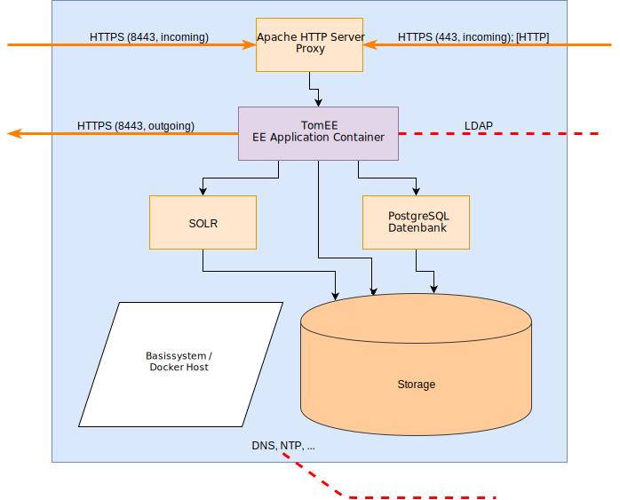

# Bausteinsicht
Dieses Kapitel beschreibt das System als eine Sammlung von Bausteinen (Module, Komponenten, Klassen, Intefaces, usw.) und ihre Beziehungen, beginnend mit der obersten Ebene (Top-Down). 

Die vorstehende Abbildung zeigt das vollständige Ökosystem der Leibniz Bioactives Cloud aus der Sicht eines Knotens. Die Pfeilrichtung zeigt immer an, aus von welchem Partner eine Verbindung aufgebaut wird. Insbesondere schließt die Darstellung die für die Initialisierung benötigten Komponenten mit ein. Bei den meisten auf dieser Ebene gezeigten Bausteinen handelt es sich um Standardkomponenten (z.B. Nutzer-PCs, normale Webserver, Software-Repositories usw.), die keiner weiteren Erläuterung oder Konfiguration bedürfen. Näherer Erläuterung bedürfen insbesondere die Bausteine

* **Knoten**
  Die Knoten sind die dezentralen Elemente der Leibniz Bioactives Cloud und stellen die Funktionen der Cloud zur Verfügung
* **Entwickler-PC**
  Der Entwickler-PC erfüllt die Aufgabe, aus dem Quellcode im Source-Code-Repository und der vom Administrator bereitgestellten Konfiguration ein individualisieres Installationspaket zu erzeugen. Ausserdem ist auf diesem Gerät die Leibniz-Bioactives Cloud-CA lokalisiert, die eine zentrale Rolle bei der Absicherung der Cloud spielt.
* **PC / Browser**
  Der PC bzw. Browser des Nutzers ist das Nutzerinterface zur Leibniz Bioactives Cloud. Neben der Kommunikation mit dem lokalen Knoten findet keine weitere Kommunikation statt; verwendete Bibliotheken wie JQuery, Bootsfaces, Stylesheets usw. werden auf dem lokalen Knoten gespiegelt.

Die Details zu Knoten und dem Entwickler-PC werden in den folgenden Abschnitten beschrieben.

## Bausteinsicht: Knoten
Die Cloud-Knoten in ihrer Gesamtheit bilden die Cloud. Jeder Knoten setzt sich aus verschiedenen Bestandteilen zusammen, um die benötigten Funktionen ausführen zu können. Die Cloud-Knoten sind weitgehend gleichberechtigt; ein Knoten fungiert jedoch als Master-Knoten und verteilt die Liste der bekannten Knoten.

Die Grafik zeigt eine schematische Darstellung eines Knotens mit den Beziehungen der Bestandteile untereinander und den Verbindungen nach außen. Verbindungen (insbesondere des Basissystems zu öffentlichen Repositorien), die nur einmalig während der Installation bzw. für Updates notwendig sind, sind nicht dargestellt. Die einzelnen Bestandteile werden nachfolgend beschrieben:
* Basissystem
* Storage
* PostgreSQL-Datenbank
* Proxy (Apache HTTP Server)
* Solr
* TomEE (Web Application Server)
Darüberhinaus wird ein Abschnitt der eigentlichen Webanwendung im TomEE Web Application Server gewidmet.

### Basissystem
Das Basissystem besteht aus einem Linux-Server in Minimalkonfiguration, der um folgende Softwarepakete (zuzüglich eventueller Abhängigkeiten) ergänzt wurde:
* Docker und Docker Compose (ab Docker Version 1.12)
* Dialog (NCurses-Dialoge für Shell-Skripte)
* cron
* ed (Zeileneditor)
* GnuZip
* M4 Makroprozessor
* OpenSSL
* sshd (nur falls Remote-Administration gewünscht wird)
* sudo
* tar
* sharutils (uuencode / uudecode)
* wget

Java ist auf dem Basissystem nicht erforderlich.

Ein Teil der Entwicklung der Leibniz Bioactives Cloud erfolgt unter OpenSUSE Leap 15.1 (Stand Mrz. 2020). Die Architektur ist jedoch weitgehend distributionsunabhängig; die Auswahl einer Distribution wird dem lokalen Administrator überlassen.

#### Init-System
Momentan unterstützt das Installationsskript vorrangig Systeme mit Systemd-Initsystem. Das traditionelle SystemV-Init kann ebenfalls noch ausgewählt werden, die Testabdeckung ist jedoch schlechter.

#### Härtung
Es wäre wünschenswert, das System durch Erweiterungen wie beispielsweise SELinux gegen Angriffe zur härten. Bislang wurden noch keine Aktionen in diese Richtung unternommen.

#### Performance
Die Docker-Performance und insbesondere der Speicherplatzbedarf sind von verwendeten Docker-Storage-Subsystem abhängig. Siehe nachfolgenden Abschnitt: Storage.

### Storage
Beim Speichersubsystem des Knotens handelt es sich um ein einfaches Verzeichnis in einem normalen Linux-Dateisystem (XFS, Ext4, ...). Das SOLR-Handbuch warnt ausdrücklich davor, den Speicher als Netzwerkdateisystem (z. B. NFS oder CIFS) zur Verfügung zu stellen. Entsprechende Empfehlungen existieren auch für PostgreSQL. Unsere Empfehlung lautet daher, den Speicher als internen Plattenspeicher, DAS oder SAN-Speicher zur Verfügung zu stellen.

> **Tip**
> Um spätere Erweiterungen des Speicherplatzes zu erleichtern, sollte das Verzeichnis für die Cloud-Daten in einem separaten Dateisystem mit darunterliegendem Volume-Management angelegt werden. Über die Natur dieses Managements (LVM, ZFS, Feature des SAN-Systems) werden keine Annahmen getroffen. Für den Anfang kann zunächst auch in der Root-Partition des Knotens gearbeitet werden.

> **Tip**
> Sollte NFS die einzig mögliche Speicheroption sein, so empfehlen wir dringend, das NFS-Volume mit den Optionen sync und hard zu mounten, um möglichst weitreichende Konsistenzgarantien zu erhalten.

Der Speicherort der Cloud-Instanz wird während der Konfiguration festgelegt und in der Datei ~/.lbac gespeichert. Während der eigentlichen Installation wird eine gleiche Datei (/root/.lbac) für den Nutzer root erzeugt, auf die durch die Init-Scripte zugegriffen wird. Durch die Datei wird die Variable $LBAC_DATASTORE definiert, die den absoluten Pfad zum eigentlichen Speicherort der Cloud-Instanz definiert.

#### On Disk Layout
Während der Konfiguration und anschließenden Installation werden in dem von der Variable $LBAC_DATASTORE folgende Verzeichnisse erzeugt:

* *backup/*
  Backups und Datenbank-Dumps
* *bin/*
  Für diverse Skripte (Installation, Backup, ...).
* *data/*
  Die Daten der Cloud (Dokumente, SOLR-Indices, PostgreSQL-Datenbanken usw.); unterhalb von /data werden entsprechend Unterverzeichnisse erzeugt:
  - *data/db/*
  - *data/solr/*
  - *data/ui/*
* *dist/*
  Die Softwaredistribution (Bibliotheken, WAR-Dateien, Konfiguration der Docker Container, usw.). Aus diesem Verzeichnis werden die Docker-Container instantiiert.
* *etc/*
  Das Verzeichnis etc/ enthält Konfigurationsdaten, Zertifikate, Credentials usw. die bereits mit dem Konfigurationsskript erfasst bzw. erzeugt werden. Im Verlauf der Installation werden die meisten dieser Daten in das Verzeichnis dist/etc/ kopiert.
* *tmp/*
  Das Verzeichnis tmp/ steht für temporäre Speicherung zur Verfügung. Während der Installation bzw. bei Updates wird dort das Installationspaket gespeichert. Ebenso speichert das Installationsskript das Logfile in diesem Verzeichnis.

#### Docker Storage
Die Standardkonfiguration des Docker-Storage-Subsystems (Verwendung eines Loop-Device) ist extrem ineffizient: Erstens wird der einmal von der Loop-Datei allozierte Speicher nicht mehr freigegeben, auch wenn die enthaltenen Volumes, Container und Images gelöscht werden. Dadurch können substanzielle Bereiche des Plattenspeichers dauerhaft blockiert werden. Zweitens ist die Verwendung eines Loop-Device die langsamste Variante. Es empfiehlt sich daher, die Standard-Einstellung des Docker-Storage-Treibers zu ändern. Am IPB liegen Erfahrungen mit dem overlay2-Treiber vor, bei dem Teile des Host-Dateisystems  per bind-mount in die Container eingeblendet werden. Dazu muss der Docker-Daemon mit der zusätzlichen Kommandozeilenoption "-s overlay2" gestartet werden.

Erfahrungen mit BTRFS, ZFS oder einem LVM thin pool im Zusammenhang mit Docker liegen am IPB bislang nicht vor, da das Root-Filesystem unserer Hosts standardmäßig mit XFS formatiert wird und unseren Hosts darüberhinaus keine weiteren Storage-Ressourcen zur Verfügung stehen.. 

